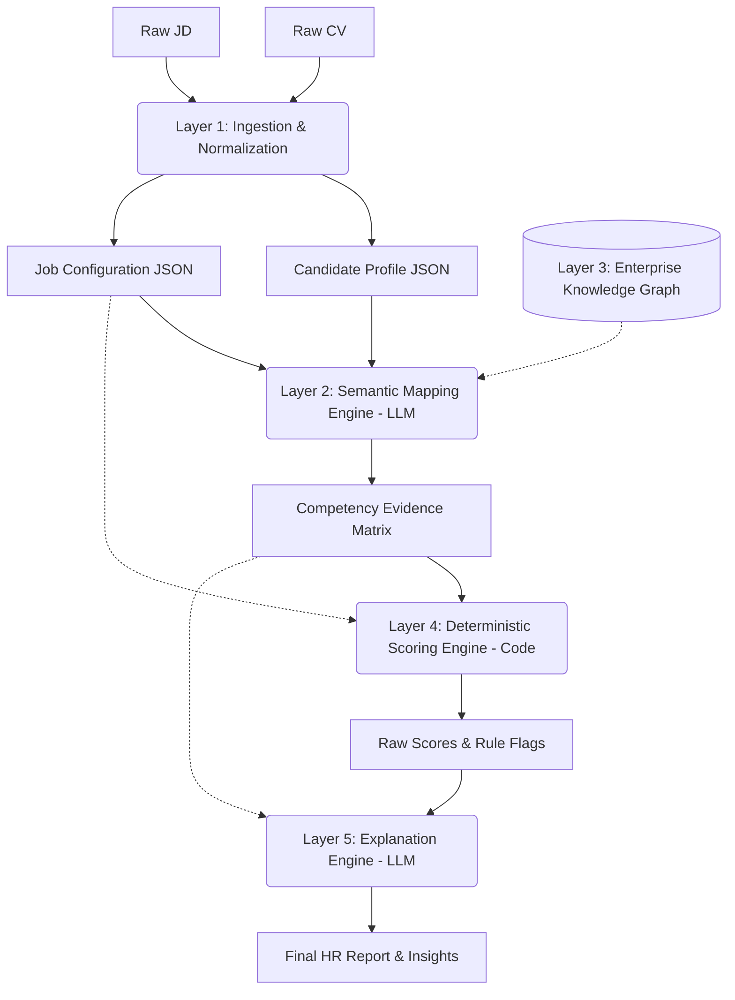

# Migration to Enterprise-Grade AI ATS Architecture: The Competency-Driven Approach

## 1. Vấn đề của Kiến trúc Hiện tại (Prompt-Driven Architecture)
Kiến trúc cũ phụ thuộc hoàn toàn vào một Prompt khổng lồ của LLM (Prompt-Driven). Mọi logic đánh giá (ví dụ: trường Đại học nào là Top, công ty nào là Tier 1, ưu tiên Fresher hay Senior) đều bị hardcode vào Prompt.
- **Hạn chế:** Không thể mở rộng (Scale). Khi muốn tuyển các phòng ban khác như Marketing, Sales, Kế toán... hệ thống sẽ sụp đổ vì các tiêu chuẩn hoàn toàn khác với ngành IT. Không thể duy trì hàng ngàn file prompt cho hàng ngàn vị trí khác nhau. Việc đánh giá qua Prompt cũng thiếu tính minh bạch và dễ bị thiên kiến (Bias).

## 2. Giải pháp: Kiến trúc Data-Driven & Competency-Based
Để hệ thống có thể mở rộng lên quy mô Enterprise (hỗ trợ hàng ngàn vị trí khác nhau mà không cần viết lại mã nguồn hay prompt), chúng ta chuyển sang mô hình tách bạch hoàn toàn:

### Sơ đồ Kiến trúc (High-Level Architecture)



### Chi tiết các Lớp (Layer Responsibilities)

1. **Layer 1: Ingestion & Normalization (LLM + NLP)**
   - Biến CV và JD từ dạng text tự do thành chuẩn JSON.
   - Chuẩn hóa tên trường học, công ty, kỹ năng (ví dụ: "Ggl" -> "Google"). Không thực hiện đánh giá ở bước này.

2. **Layer 2: Semantic Mapping Engine (LLM)**
   - **Nhiệm vụ duy nhất của LLM:** Đối chiếu Candidate Profile với các Năng lực (Competencies) yêu cầu trong Job Config để tìm ra "Bằng chứng" (Evidence).
   - LLM không chấm điểm (No Scoring). Nó chỉ trích xuất dẫn chứng (Ví dụ: "Ứng viên có kỹ năng Lãnh đạo vì từng quản lý team 5 người").

3. **Layer 3: Enterprise Knowledge Graph (Database)**
   - Lưu trữ toàn bộ "Kiến thức miền" (Domain Knowledge) như: Danh sách trường Top, Công ty Tier 1, Cây kỹ năng (Skill Taxonomy).
   - Giúp tách business logic ra khỏi Prompt.

4. **Layer 4: Deterministic Scoring Engine (Code/Math)**
   - **Lớp này KHÔNG dùng LLM.** Sử dụng Python/Java thuần để tính toán điểm số dựa trên Evidence Matrix (Layer 2) và Trọng số (Weights) được cấu hình trong Job Config.
   - Đảm bảo tính công bằng (Fairness), nhất quán 100% và có thể audit.

5. **Layer 5: Explanation Engine (LLM)**
   - Chuyển đổi các con số khô khan từ Layer 4 thành lời nhận xét tự nhiên, giúp HR dễ dàng đọc hiểu và ra quyết định.

---

## 3. Quản lý Dữ liệu và Cấu hình (Data & Configuration Models)

Sức mạnh của kiến trúc này nằm ở **Mô hình Năng lực (Competency Framework)**. Một công việc không còn là đoạn text mô tả nữa, mà là một JSON Configuration.

**Ví dụ một Job Configuration:**
```json
{
  "job_id": "MKT_DIR_001",
  "job_family": "MARKETING",
  "career_level": "DIRECTOR",
  "scoring_weights": {
    "hard_skills": 0.3,
    "soft_skills": 0.3,
    "experience_depth": 0.3,
    "institutional_pedigree": 0.1
  },
  "required_competencies": [
    { "competency_id": "COMP_MKT_STRATEGY", "weight": 5, "required_level": 3 },
    { "competency_id": "COMP_LEADERSHIP_01", "weight": 4, "required_level": 2 }
  ],
  "institutional_rules": [
    { "rule_id": "TIER_1_AGENCY_EXP", "bonus_points": 10 }
  ]
}
```
*Việc thay đổi từ tuyển Fresher IT sang Director Marketing giờ đây chỉ đơn thuần là truyền một file JSON Configuration khác vào Engine, hệ thống AI không hề thay đổi.*

---

## 4. Giải quyết Vấn đề Hardcode & Bias

Hệ thống sẽ không bao giờ có các dòng lệnh hoặc prompt như:
`Nếu học đại học Bách Khoa thì cộng 20 điểm`.

Thay vào đó, nó sẽ được trừu tượng hóa thành:
`Nếu [Job Config] yêu cầu [Target School] = True, VÀ [Candidate.University.Tier] == 'TIER_1', thì áp dụng [Pedigree Weight]`.

Mọi định nghĩa về trường học Tier 1, công ty Tier 1 đều nằm trong Database (Layer 3). Nếu HR muốn ưu tiên thêm một trường đại học khác, họ chỉ cần update Database thay vì phải sửa code hay sửa Prompt. Điều này loại bỏ bias cố hữu trong prompt và cho phép kiểm soát 100% tiêu chí tuyển dụng.

---

## 5. Chiến lược Mở rộng (Extension Strategy)

Khi công ty mở thêm một phòng ban mới (ví dụ: Legal / Pháp chế):
1. HR vào hệ thống định nghĩa bộ Năng lực (Competencies) cho ngành Luật.
2. Tạo Job Configuration mới (chọn trọng số và yêu cầu).
3. **Kết quả:** Hệ thống AI tự động xử lý được CV ngành Luật lập tức. Zero code changes. Zero prompt changes.
