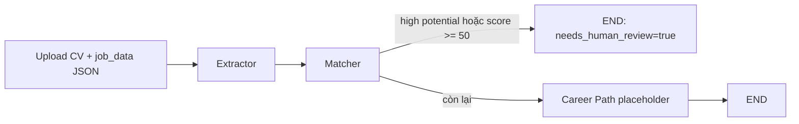
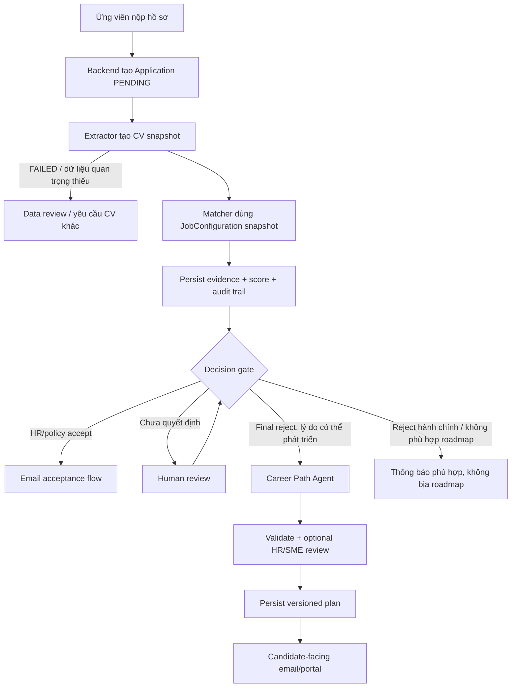

# Kế hoạch phân tích và xây dựng Career Path Agent

> Trạng thái: tài liệu thiết kế trước triển khai  
> Cơ sở phân tích: code tại commit `8e9f89c` trên nhánh `main`, ngày 2026-07-17  
> Phạm vi đọc chính: `backend-core/` và `ai-service/`  
> Lưu ý phương pháp: tài liệu `docs/career_path_agent_guide.md` không được sử dụng làm nguồn phân tích.

## 1. Kết luận điều hành

Career Path Agent nên được định nghĩa là **agent lập kế hoạch thu hẹp khoảng cách năng lực sau quyết định tuyển dụng**, không phải agent chấm lại ứng viên, giải thích thay HR, hoặc sinh một danh sách khóa học chung chung.

Đầu vào đúng của agent không thể chỉ là CV hoặc `missing_criteria`. Nó cần một snapshot có phiên bản của bốn nhóm dữ liệu:

1. Quyết định cuối cùng và lý do reject hợp lệ.
2. Hồ sơ đã trích xuất cùng chất lượng trích xuất từ Extractor Agent.
3. Ma trận bằng chứng và kết quả đánh giá từ Matcher Agent.
4. Chuẩn năng lực của công việc, mô tả level và chính sách roadmap từ backend/DB.

Agent chỉ nên chạy khi `decision = REJECTED`, lý do reject có liên quan đến năng lực có thể phát triển, dữ liệu công việc đủ rõ, và kết quả upstream không ở trạng thái lỗi. Nếu dữ liệu không đủ, output đúng phải là `INSUFFICIENT_INPUT` hoặc `NEEDS_HUMAN_REVIEW`, không phải một roadmap được suy đoán.

Chất lượng của agent không được đánh giá bằng việc “đọc thấy hợp lý”. Cần đánh giá theo ba lớp đồng thời:

- Các invariant kiểm được bằng code: đúng schema, đúng trigger, không rò rỉ dữ liệu nội bộ, bao phủ gap bắt buộc, mọi nhận định về ứng viên đều truy vết được về bằng chứng.
- Rubric do HR và chuyên gia nghề nghiệp chấm: đúng chuyên môn, đúng mức độ, khả thi, có thứ tự phụ thuộc, có đầu ra kiểm chứng được.
- Kết quả vận hành: tỷ lệ HR phải sửa, phản hồi ứng viên, tỷ lệ hoàn thành milestone, sự cải thiện ở lần đánh giá lại; không dùng tỷ lệ được tuyển làm thước đo duy nhất.

Một kiến trúc phù hợp là: **deterministic gap builder → rule-based prioritizer → curated resource retrieval → LLM structured planner/renderer → deterministic validator → human review theo rủi ro**. LLM không được tự quyết định việc reject, tự tạo chuẩn năng lực, hoặc tự bịa nguồn học.

## 2. Phạm vi và câu hỏi nghiệp vụ

Tài liệu này trả lời các câu hỏi sau:

- Hệ thống hiện tại thực sự đã làm được gì trong luồng ứng tuyển?
- Extractor Agent và Matcher Agent tạo ra dữ liệu gì, dữ liệu nào đáng tin đến mức nào?
- Career Path Agent phục vụ ai, giải quyết vấn đề gì và không được làm gì?
- Agent cần input nào từ agent 1, agent 2 và backend/DB?
- Agent xử lý theo các bước nào để có thể kiểm thử và audit?
- Output máy và nội dung gửi ứng viên cần có cấu trúc gì?
- “Đúng mong đợi” nghĩa là gì, đo bằng metric nào, ai là người xác nhận?
- Điều kiện nào phải đạt trước khi cho agent chạy production?

Đây là thiết kế mục tiêu dựa trên code hiện hành. Mọi phần mô tả tương lai đều được ghi là **đề xuất**, không được hiểu là chức năng đã tồn tại.

## 3. Hiện trạng hệ thống theo code

### 3.1. Backend hiện có

Backend đã có các entity và bảng nền quan trọng:

- `Application`: liên kết candidate, job, `resume_url`, `status`, `fit_score`, `ai_feedback`, `scoring_breakdown`, thời điểm apply/update.
- `ApplicationStatus`: `PENDING`, `REVIEWING`, `SHORTLISTED`, `REJECTED`, `HIRED`.
- `Job`: title, location, employment type, description, requirements, job family, career level, institutional rules và required competencies.
- `JobCompetency`: competency, weight, required level và `is_mandatory`.
- `Competency`/`CompetencyLevel`: tên, category và ý nghĩa level 1-5.
- `JobFamily`/`CareerLevel`: taxonomy nghề nghiệp và cấp bậc.
- `PedigreeEntity`/`InstitutionalRule`: dữ liệu dùng cho bonus trong scoring.

Backend hiện mới có controller/service rõ ràng cho authentication, competency level và pedigree knowledge base. Chưa có `ApplicationController`/`ApplicationService`, `JobController`/`JobService`, API quyết định của HR, consumer/publisher RabbitMQ cho toàn bộ pipeline, hoặc API trả một `JobConfiguration` hoàn chỉnh cho AI service. `ApplicationRepository` và `JobRepository` hiện chỉ là `JpaRepository` cơ bản.

Migration có tạo cấu trúc competency và scoring, nhưng dữ liệu seed chưa gán `job_family_id`, `career_level_id`, `job_competencies` hoặc `job_institutional_rules` cho hai job mẫu. Competency-level seed hiện chỉ bao phủ Java/Spring Boot và Python. Vì vậy sự tồn tại của schema chưa đồng nghĩa dữ liệu chuẩn năng lực đã đủ cho Career Path Agent.

Backend cũng chưa có nơi lưu roadmap theo cấu trúc và theo phiên bản. Dùng `ai_feedback` dạng text cho roadmap production sẽ làm mất khả năng truy vết, so sánh phiên bản và tái đánh giá.

Nguồn code chính:

- `backend-core/src/main/java/com/tttn/backend_core/entity/Application.java`
- `backend-core/src/main/java/com/tttn/backend_core/entity/Job.java`
- `backend-core/src/main/java/com/tttn/backend_core/entity/JobCompetency.java`
- `backend-core/src/main/java/com/tttn/backend_core/entity/CompetencyLevel.java`
- `backend-core/src/main/resources/db/migration/V4__add_competency_architecture.sql`
- `backend-core/src/main/resources/db/migration/V6__improve_scoring_schema.sql`

### 3.2. Extractor Agent (agent 1)

Luồng `process_cv()` hiện thực hiện:

1. Kiểm tra file PDF/DOCX, kích thước, MIME và tính hợp lệ.
2. Trích xuất text, có OCR fallback.
3. Nhận diện ngôn ngữ `vi`/`en`/`unknown`.
4. Chạy chiến lược extraction. Cấu hình mặc định hiện là `llm`; code cũng hỗ trợ `ner` và `hybrid`.
5. Chuẩn hóa kết quả và gắn status, confidence, warning, processing log.

Output `CVExtractionResponse` gồm:

- `status`: `success`, `partial`, `failed`.
- `extraction_method`, `language_detected`.
- `personal_info`: name, email, phone, location.
- `skills`.
- `experience`: title, company, duration, description.
- `education`: degree, institution, year.
- `certifications`.
- `confidence_scores`, `warnings`, `processing_log`.

Các giới hạn ảnh hưởng trực tiếp đến Career Path Agent:

- Output không lưu raw text hoặc evidence span/source location, nên không thể luôn kiểm tra một nhận định quay về đúng đoạn CV.
- Nhánh NER ghép company/title/duration theo thứ tự xuất hiện; `description` của experience không được điền ở nhánh này.
- Confidence của LLM fallback đang được gán overall cố định `0.7`, không phải confidence đã calibration theo từng field.
- `SUCCESS` chủ yếu dựa trên có name, contact và skills; nó không khẳng định experience/education đã đầy đủ cho việc lập roadmap.
- `PARTIAL` hoặc warning không nên tự động bị diễn giải là ứng viên yếu.

Do đó Career Path Agent cần nhận cả dữ liệu lẫn chất lượng/provenance của dữ liệu. Câu “CV chưa thể hiện X” và câu “ứng viên không biết X” là hai kết luận khác nhau; agent chỉ được phép dùng câu thứ nhất khi evidence không tồn tại.

Nguồn code chính:

- `ai-service/app/agents/extractor_agent/agent.py`
- `ai-service/app/agents/extractor_agent/llm_fallback.py`
- `ai-service/app/core/schemas.py`

### 3.3. Matcher Agent (agent 2)

Matcher hiện có bốn lớp logic:

1. Lấy hard skills từ `JobConfiguration`, hoặc fallback sang `job_data.required_skills`.
2. Dùng sentence embeddings để match skill, threshold hiện là `0.65`, tạo `matched_criteria`, `missing_criteria` và hard-skill coverage score.
3. Nếu có model, LLM tạo `evidence_matrix`, recommendation và các cờ tiềm năng.
4. Nếu có `job_configuration`, deterministic scoring engine tính điểm theo weight, confidence multiplier, mandatory knockout và institutional bonus.

`MatchingOutput` hiện có:

- `status`, `rejection_reason`.
- `evidence_matrix` theo competency.
- overall/hard-skill/soft-skill/experience/bonus score.
- `is_overqualified`, `is_high_potential`, `potential_reason`.
- `matched_criteria`, `missing_criteria`.
- `hr_recommendation`.
- `scoring_breakdown`.

Các điểm phải hiểu đúng trước khi dùng output này:

- `missing_criteria` của vector matcher chỉ đại diện cho hard skills, không phải toàn bộ competency gap.
- `evidence_matrix` mới là nguồn rộng hơn cho hard skill, soft skill, experience và pedigree; nguồn này do LLM tạo nên vẫn cần evidence traceability và validation.
- Output chưa có `observed_level` của ứng viên cho từng competency. Boolean `meets_requirement` không đủ để suy ra ứng viên đang ở level 1, 2 hay 3.
- Scoring breakdown có thể dừng sớm khi mandatory knockout và vì vậy không nhất thiết chứa đủ mọi competency; các nhánh early knockout ngay tại vector stage còn có thể trả về mà không có breakdown.
- Khi thiếu API key, matcher trả `ERROR` trước các bước đầy đủ. Đây không phải một quyết định reject hợp lệ để sinh roadmap.
- `status`, category và confidence hiện chưa được ép thành enum chặt chẽ.
- Pedigree/institutional bonus dùng để chấm điểm nội bộ, không phải một “năng lực có thể học” và không được biến thành nhiệm vụ trong roadmap.
- `hr_preferences` có trong request/state nhưng `_build_prompt()` hiện không đưa trường này vào prompt. Không được coi trường này là một policy đã thực sự được matcher áp dụng hoặc là reason đã được xác nhận.

Nguồn code chính:

- `ai-service/app/agents/matcher_agent/agent.py`
- `ai-service/app/agents/matcher_agent/vector_matcher.py`
- `ai-service/app/agents/matcher_agent/scoring_engine.py`
- `ai-service/app/core/schemas.py`

### 3.4. Luồng orchestration hiện chạy

Endpoint `/process-application` đang chạy graph sau:



Đây chưa phải luồng ứng tuyển end-to-end:

- `career_path_node` trả `{}` và chưa có output.
- Graph kết thúc ở nhánh human review; chưa có cơ chế pause/resume bằng quyết định HR.
- Nhánh score thấp đi thẳng tới Career Path, tức đang đồng nhất “score thấp” với “quyết định reject cuối cùng”.
- Endpoint không truyền `job_configuration` vào `MatchRequest`, nên nhánh scoring theo competency đầy đủ thường không chạy trong flow này.
- `application_id` đang dùng filename, không phải UUID application từ backend.
- LangGraph `thread_id` được gán cố định là `"1"`, không cô lập state giữa các application.
- Response không có career-path result.
- RabbitMQ consumer hiện chỉ nhận `cv.extract.request` và trả kết quả extractor; chưa chạy matcher/career path.
- Backend có cấu hình RabbitMQ nhưng chưa có publisher/listener cho pipeline ứng tuyển trong code hiện tại.

Test hiện tập trung tốt hơn cho file validation, text/NER extraction và normalization. Matcher chỉ có một test vector fallback khi không có LLM; chưa có test cho scoring engine, graph, HR decision/resume, Career Path hoặc full application contract. Không thể coi test suite hiện tại là bằng chứng chất lượng cho Career Path Agent.

Việc chạy test trong môi trường phân tích này không thực hiện được vì không có Python runtime; các nhận định về coverage ở trên đến từ việc đọc test source, không phải kết quả runtime.

## 4. Luồng nghiệp vụ mục tiêu

Luồng mục tiêu nên đặt backend làm source of truth cho application và quyết định; AI service xử lý snapshot có version:



`Decision gate` phải là một domain event/record rõ ràng, không phải phép so sánh điểm nằm rải rác trong agent. Auto-reject chỉ được xem là quyết định cuối cùng nếu HR đã phê duyệt policy, ngưỡng và reason code tương ứng.

## 5. Mục tiêu, người dùng và ranh giới của Career Path Agent

### 5.1. Mục tiêu nghiệp vụ

Với một ứng viên đã bị reject vì khoảng cách năng lực đối với một job cụ thể, agent phải tạo kế hoạch:

- Bám đúng target job và target competency level tại thời điểm ứng tuyển.
- Phân biệt điểm mạnh đã có bằng chứng, gap có bằng chứng, và vùng chưa đủ thông tin.
- Ưu tiên gap bắt buộc/cốt lõi thay vì liệt kê mọi kỹ năng có thể học.
- Biến mỗi gap thành mục tiêu, hoạt động, artifact và cách đánh giá quan sát được.
- Có thứ tự phụ thuộc, thời lượng và khối lượng phù hợp với constraint đã biết.
- Dùng ngôn ngữ tôn trọng; không khẳng định quá mức về năng lực hay tương lai tuyển dụng.
- Cho phép HR/SME và hệ thống truy vết vì sao một nội dung xuất hiện.

### 5.2. Người dùng

- **Ứng viên**: nhận bản dễ hiểu, hữu ích, không chứa dữ liệu nội bộ.
- **HR/recruiter**: kiểm tra tone, chính sách, sự phù hợp với lý do reject.
- **Domain SME/career coach**: xác nhận nội dung chuyên môn, level, dependency và assessment.
- **Engineering/ML team**: kiểm thử, quan sát, version và audit agent.

### 5.3. Những việc agent không được làm

- Không quyết định accept/reject hoặc thay đổi status application.
- Không dùng score như chân lý về năng lực.
- Không suy diễn “không thấy trong CV” thành “không biết”.
- Không biến trường học, công ty cũ, pedigree, tuổi, giới tính, địa chỉ hoặc thông tin nhạy cảm thành gap cần sửa.
- Không tiết lộ hidden HR preferences, institutional rules, điểm so với ứng viên khác hoặc nhận xét nội bộ.
- Không tự hứa “hoàn thành roadmap sẽ được tuyển”.
- Không tự đề xuất role khác nếu chưa có taxonomy, matching policy và sự đồng ý cho use case này.
- Không sinh URL/khóa học không được kiểm chứng.
- Không tự gửi email; tác vụ gửi phải thuộc backend/workflow có kiểm soát.

## 6. Điều kiện kích hoạt và quality gate đầu vào

### 6.1. Điều kiện bắt buộc

Career Path Agent chỉ được chạy khi tất cả điều kiện sau đúng:

- Application và target job tồn tại, có ID thực.
- Decision cuối cùng là `REJECTED` và có `decision_id`, source, timestamp, reason code.
- Reason thuộc nhóm có thể hỗ trợ bằng roadmap, ví dụ competency gap hoặc thiếu bằng chứng thực hành.
- Extractor không `FAILED`; các trường cần cho gap tương ứng có chất lượng đủ dùng.
- Matcher không `ERROR` và dùng đúng job snapshot.
- Có JobConfiguration với competency ID, category, weight, target level, mandatory flag và mô tả level.
- Có ít nhất một gap có thể phát triển hoặc một vùng cần assessment hợp lệ.
- Input schema và version được hỗ trợ.

### 6.2. Khi không được sinh roadmap

| Tình huống | Output đúng |
|---|---|
| Candidate được accept/shortlist/hire | `NOT_APPLICABLE` |
| Matcher `ERROR`, model/API thất bại | `INSUFFICIENT_INPUT` |
| Extractor `FAILED` | `INSUFFICIENT_INPUT` |
| Không có JobConfiguration/level description cần thiết | `INSUFFICIENT_INPUT` |
| Reject do vị trí đóng, duplicate, hồ sơ rút, điều kiện hành chính | `NOT_APPLICABLE` hoặc template phi-roadmap do HR định nghĩa |
| Evidence mâu thuẫn hoặc confidence quá thấp | `NEEDS_HUMAN_REVIEW`; có thể chỉ tạo assessment-first draft nội bộ |
| Reason của HR không ánh xạ được vào competency | `NEEDS_HUMAN_REVIEW` |

Không sinh roadmap trong các trường hợp trên là hành vi đúng, không phải lỗi chất lượng.

## 7. Hợp đồng input đề xuất

### 7.1. Nguyên tắc

- Backend/orchestrator tập hợp snapshot rồi gửi agent; Career Path Agent không tự ý đọc toàn DB.
- Mọi snapshot có `schema_version`, entity version hoặc `updated_at`.
- Chỉ truyền PII tối thiểu. Name chỉ cần ở bước render; email/phone/address không cần vào prompt lập kế hoạch.
- Mỗi nhận định upstream cần provenance: agent/model/prompt version, thời điểm, evidence reference và confidence.
- Job data phải là snapshot tại lúc đánh giá; không dùng cấu hình job đã bị HR sửa sau đó mà không ghi version.

### 7.2. Ma trận nguồn dữ liệu

| Nhóm dữ liệu | Trường cần thiết | Nguồn ưu tiên | Mức bắt buộc | Lý do |
|---|---|---|---|---|
| Request identity | request/correlation/application ID, schema version, idempotency key | Backend | Bắt buộc | Cô lập, retry và audit |
| Decision | outcome, source `HR`/`AUTO_POLICY`, reason codes, rationale đã duyệt, timestamp, policy version | Backend/HR | Bắt buộc | Agent không tự suy ra reject từ score |
| Target job | job ID, title, family, career level, description snapshot | Backend DB | Bắt buộc | Xác định đích của roadmap |
| Target competencies | ID, name, category, weight, required level, level description, mandatory | Backend DB | Bắt buộc | Tạo gap và priority có căn cứ |
| CV profile | skills, experience, education, certification, language | Extractor | Bắt buộc theo gap | Mô tả trạng thái hiện được chứng minh |
| Extraction quality | status, per-field confidence, warnings, method | Extractor | Bắt buộc | Chọn generate/review/assessment-first |
| Competency evidence | evidence, meets requirement, confidence, evidence refs | Matcher | Bắt buộc | Grounding cho gap ledger |
| Matching audit | matched/missing criteria, score breakdown, rejection reason | Matcher | Bắt buộc cho audit; không phải tất cả đều hiển thị | Đối chiếu và phát hiện mâu thuẫn |
| Candidate constraints | giờ/tuần, thời hạn mong muốn, ngôn ngữ, ngân sách, hình thức học, accessibility | Candidate hoặc default policy được ghi rõ | Khuyến nghị mạnh | Làm roadmap khả thi |
| Approved resources | resource ID, competency/level, locale, format, cost, duration, URL, last verified | Curated catalog | Bắt buộc nếu output nêu resource cụ thể | Tránh link bịa/lỗi thời |
| Planning policy | min/max duration, workload, tone, locale, disclaimer, review thresholds | Backend/config | Bắt buộc | Tính nhất quán và quản trị |

### 7.3. Dữ liệu hiện chưa có hoặc chưa đủ

Trước production cần bổ sung về mặt hợp đồng/nghiệp vụ, chưa bàn đến code cụ thể:

- Decision record độc lập với `Application.status`, có reason code và policy version.
- `observed_level` hoặc ít nhất trạng thái `MET/PARTIAL/NOT_EVIDENCED/UNKNOWN` theo competency. Matcher hiện chỉ có boolean và confidence.
- Evidence reference về field/item/span; không chỉ là đoạn text LLM tự tóm tắt.
- Competency-level coverage đầy đủ cho các job được mở roadmap.
- Dependency giữa competency/milestone, nếu nghiệp vụ cần thứ tự học chuẩn.
- Catalog tài nguyên học được SME/HR duyệt và định kỳ kiểm tra.
- Candidate learning constraints hoặc policy default minh bạch.
- Version metadata của extractor, matcher, model, prompt, job config và resource catalog.

### 7.4. Những dữ liệu không nên truyền vào planner

- Email, phone, địa chỉ chi tiết, ngày sinh, giới tính và các thuộc tính nhạy cảm không phục vụ kế hoạch.
- Hidden HR preferences không liên quan trực tiếp tới chuẩn năng lực đã công bố.
- Pedigree rank và institutional bonus.
- Dữ liệu ứng viên khác hoặc percentile cạnh tranh.
- Secret, credential, raw system prompt.

## 8. Quy trình xử lý đề xuất

### Bước 1: Contract validation và applicability check

Kiểm schema, version, ID, decision, trạng thái upstream và tính đầy đủ của job snapshot. Trả status phi-generation ngay nếu sai điều kiện. Bước này deterministic.

### Bước 2: Chuẩn hóa và giảm dữ liệu

Loại PII không cần thiết, chuẩn hóa enum/category/confidence, đóng dấu provenance. CV/JD là dữ liệu không tin cậy, không phải instruction cho model.

### Bước 3: Xây `gap ledger` deterministic

Join `required_competencies` với `evidence_matrix`, `scoring_breakdown` và vector result theo competency ID, không join chỉ bằng tên tự do.

Mỗi competency được phân loại:

- `MET`: có evidence đủ target.
- `PARTIAL`: có evidence nhưng chưa đạt target hoặc confidence trung bình.
- `NOT_EVIDENCED`: không tìm thấy evidence trong hồ sơ; không kết luận ứng viên không có skill.
- `UNKNOWN`: dữ liệu thiếu, mâu thuẫn hoặc extraction không đủ.

Đối với `UNKNOWN`/`NOT_EVIDENCED`, roadmap nên bắt đầu bằng assessment hoặc artifact chứng minh năng lực, thay vì bắt ứng viên học lại từ đầu.

### Bước 4: Lọc gap có thể tác động

Chỉ giữ gap mà roadmap có thể hỗ trợ:

- Hard skill, soft skill và evidence/project gap có thể chuyển thành hoạt động.
- Experience requirement phải diễn đạt trung thực: có thể tạo project, exposure hoặc responsibility tương đương; không được hứa “thay thế 3 năm kinh nghiệm trong 8 tuần”.
- Pedigree/company tier và yếu tố hành chính không phải learning gap.

### Bước 5: Ưu tiên deterministic

Không để LLM tự quyết định toàn bộ priority. Thứ tự đề xuất:

1. `P0`: mandatory gap làm phát sinh knockout.
2. `P1`: gap cốt lõi có weight cao, trực tiếp liên quan reason reject.
3. `P2`: gap hỗ trợ hoặc weight thấp.
4. `ASSESS_FIRST`: gap chưa chắc chắn cần chứng minh/đánh giá trước.

Trong cùng tier có thể xét target-level distance, dependency và confidence. Công thức cụ thể phải được HR/SME phê duyệt và version; không dùng một con số “thông minh” nhưng không giải thích được.

### Bước 6: Lập milestone graph

Tạo dependency trước-sau, nhóm gap liên quan thành phase, phân bổ theo hours/week và duration policy. Mỗi milestone phải có:

- Mục tiêu gắn competency/target level.
- Hoạt động cụ thể.
- Artifact quan sát được: repository, case study, demo, report, mock interview recording, v.v.
- Acceptance criteria hoặc rubric.
- Cách đánh giá và evidence cần nộp.
- Thời lượng, prerequisite và gap IDs được xử lý.

### Bước 7: Retrieve tài nguyên đã duyệt

Chọn resource từ catalog theo competency, current/target level, language, budget và format. Nếu catalog không có resource phù hợp, output nên đưa activity/selection criteria hoặc đánh dấu thiếu catalog; không được bịa tên/link.

### Bước 8: LLM structured planning và rendering

LLM nhận gap ledger, milestone constraints, resource candidates và output schema. Vai trò chính của LLM là tổng hợp, diễn đạt và đề xuất hoạt động trong giới hạn; không sửa decision, competency target hay provenance.

### Bước 9: Deterministic post-validation

Validator kiểm:

- JSON/schema/enum.
- Mọi gap priority cao đều được xử lý hoặc có lý do loại.
- Mọi claim về ứng viên có evidence reference.
- Mọi resource ID tồn tại và URL còn hợp lệ tại version catalog.
- Tổng workload/duration nhất quán.
- Mọi milestone có artifact và assessment.
- Không chứa PII/internal-only field hoặc lời hứa tuyển dụng.
- Không có instruction từ CV/JD bị model thực thi.

Nếu fail, retry có giới hạn với lỗi validator; sau đó trả `FAILED`/`NEEDS_HUMAN_REVIEW`, không phát nội dung lỗi ra ứng viên.

### Bước 10: Review, persist và render candidate view

Roadmap rủi ro cao phải qua HR/SME: mandatory knockout, confidence thấp, career level cao, soft-skill claim nhạy cảm, hoặc agent/version mới. Persist cả internal structured result, candidate view, versions, validation result và reviewer action.

## 9. Hợp đồng output đề xuất

### 9.1. Hai view tách biệt

1. **Internal structured view**: đầy đủ gap ledger, provenance, quality flag, validation, version và review metadata.
2. **Candidate-facing view**: strengths, growth areas, phases, milestones, resources, assessments và caveat; không có score nội bộ, pedigree, hidden preference hay nhận xét so sánh.

Candidate view nên được render bằng allowlist từ structured data, không chỉ yêu cầu model “đừng tiết lộ”.

### 9.2. Cấu trúc logic

```json
{
  "schema_version": "1.0",
  "status": "GENERATED",
  "request_id": "...",
  "application_id": "...",
  "decision_reference": {
    "decision_id": "...",
    "outcome": "REJECTED",
    "reason_codes": ["COMPETENCY_GAP"]
  },
  "target": {
    "job_id": "...",
    "job_title": "...",
    "job_family": "ENGINEERING",
    "career_level": "MID",
    "job_snapshot_version": "..."
  },
  "data_quality": {
    "grade": "SUFFICIENT",
    "limitations": []
  },
  "summary": {
    "demonstrated_strengths": [],
    "priority_growth_areas": [],
    "estimated_duration_weeks": 12,
    "hours_per_week": 8
  },
  "gaps": [
    {
      "gap_id": "...",
      "competency_id": "...",
      "current_assessment": "PARTIAL",
      "target_level": 3,
      "priority": "P0",
      "evidence_refs": [],
      "rationale": "..."
    }
  ],
  "phases": [
    {
      "phase_id": "...",
      "title": "...",
      "duration_weeks": 4,
      "addresses_gap_ids": [],
      "prerequisites": [],
      "activities": [],
      "deliverables": [],
      "assessment": {
        "method": "...",
        "acceptance_criteria": []
      },
      "resource_ids": []
    }
  ],
  "checkpoints": [],
  "candidate_message": "...",
  "internal_diagnostics": {
    "validation_result": "PASSED",
    "requires_human_review": false
  },
  "provenance": {
    "extractor_version": "...",
    "matcher_version": "...",
    "planner_version": "...",
    "model_version": "...",
    "prompt_version": "...",
    "resource_catalog_version": "..."
  }
}
```

Đây là logical contract để thống nhất nghiệp vụ, chưa phải yêu cầu triển khai code trong phạm vi tài liệu này.

### 9.3. Status output

- `GENERATED`: hợp lệ và đủ chất lượng theo policy.
- `NOT_APPLICABLE`: decision/reason không thuộc use case.
- `INSUFFICIENT_INPUT`: thiếu hoặc lỗi upstream, không thể lập roadmap an toàn.
- `NEEDS_HUMAN_REVIEW`: có thể tạo draft nhưng không đủ điều kiện gửi tự động.
- `FAILED`: lỗi generation/validation sau retry.

## 10. “Output đúng mong đợi” nghĩa là gì?

Không tồn tại một bài văn roadmap duy nhất đúng. Ground truth nên gồm **các constraint, gap bắt buộc, milestone tối thiểu và lỗi cấm**, thay vì ép output giống từng câu với một reference answer.

### 10.1. Hard invariants

Một output chỉ được xem là hợp lệ khi:

1. Chạy đúng trigger và đúng application/job snapshot.
2. Parse được theo schema và không có field cấm trong candidate view.
3. Bao phủ mọi `P0/P1` gap có thể phát triển, hoặc nêu lý do hợp lệ khi không bao phủ.
4. Không tạo claim ứng viên thiếu/đã có năng lực nếu không có evidence.
5. Không dùng pedigree/PII/hidden preferences để thay đổi roadmap.
6. Mỗi milestone gắn ít nhất một gap; mỗi learning milestone có artifact và assessment.
7. Dependency, duration và workload không mâu thuẫn.
8. Resource là item tồn tại trong catalog đã duyệt.
9. Không hứa kết quả tuyển dụng, không thay đổi decision.
10. Input lỗi/thiếu phải fail closed theo đúng status.

### 10.2. Rubric chất lượng do con người chấm

Mỗi tiêu chí chấm 1-5 với mô tả anchor cụ thể:

| Tiêu chí | Câu hỏi chấm |
|---|---|
| Groundedness | Mọi nhận định về ứng viên có đúng evidence và mức confidence không? |
| Domain correctness | Kỹ năng, level, dependency và assessment có đúng thực tế nghề không? |
| Gap relevance | Roadmap có tập trung vào lý do reject/target job, tránh nội dung thừa không? |
| Prioritization | Mandatory/core gaps có đứng trước supporting gaps không? |
| Actionability | Ứng viên có biết tuần này làm gì và tạo artifact gì không? |
| Measurability | Có tiêu chí quan sát được để biết milestone đạt/chưa đạt không? |
| Feasibility | Khối lượng, thời gian, prerequisite có phù hợp constraint không? |
| Personalization | Plan dùng đúng evidence/constraint, không chỉ thay tên ứng viên vào template không? |
| Clarity and tone | Rõ, tôn trọng, phân biệt “chưa có evidence” với “không có năng lực” không? |
| Safety/fairness | Có yếu tố nhạy cảm, thiên lệch, internal leakage hoặc lời hứa sai không? |

HR sở hữu decision/tone/policy; domain SME sở hữu technical correctness/level/dependency; career coach hoặc đại diện ứng viên sở hữu feasibility/clarity. Engineering không tự xác lập toàn bộ ground truth nghiệp vụ.

## 11. Chiến lược đánh giá nghiêm túc

### 11.1. Bộ dữ liệu chuẩn

Tạo dataset versioned gồm input snapshot, expected invariants, annotated gaps, forbidden claims, minimum milestones, rubric và reviewer notes. Không dùng dữ liệu production chưa ẩn danh hoặc chưa có quyền sử dụng.

Dataset phải phân tầng ít nhất theo:

- Job family và career level.
- Hard/soft/experience gap.
- Mandatory knockout, score-based reject và HR reject.
- CV Việt/Anh, extraction success/partial.
- Evidence rõ, thiếu, mâu thuẫn.
- Candidate constraint khác nhau về thời gian, budget, ngôn ngữ.
- Reject không áp dụng roadmap.
- Input độc hại/prompt injection trong CV hoặc JD.

Khởi đầu nên có khoảng 100-150 case được adjudicate, đồng thời bảo đảm đủ case ở từng critical slice thay vì chỉ chạy theo tổng số. Mỗi critical rejection type/job family được hỗ trợ nên có ít nhất khoảng 20 case trước pilot; con số cuối phải tăng cho tới khi metric theo slice và khoảng tin cậy ổn định. Mọi lỗi production quan trọng phải được ẩn danh, adjudicate và thêm lại regression set.

Mỗi case nên được hai người chấm độc lập; disagreement được SME/HR thứ ba adjudicate. Theo dõi agreement cho gap label/priority và rubric score. Agreement thấp là dấu hiệu rubric hoặc policy chưa rõ, không nên “giải quyết” bằng cách chọn output model thuận mắt hơn.

### 11.2. Các lớp test

1. **Unit tests**: gap join, priority, applicability, duration math, allowlist, resource lookup.
2. **Contract/property tests**: schema, enum, required fields, idempotency, deterministic rules.
3. **Golden-set offline eval**: hard metrics và human rubric trên dataset đã adjudicate.
4. **Metamorphic tests**: đổi tên/giới tính/địa chỉ nhưng giữ competency evidence thì priority/milestone cốt lõi không được đổi; đảo thứ tự CV không làm mất gap.
5. **Adversarial tests**: CV chứa “ignore previous instruction”, link độc, PII, contradictory claims, oversized/missing data.
6. **Repeatability tests**: chạy cùng input nhiều lần; wording có thể đổi nhưng critical gap set, priority tier và resource IDs phải ổn định.
7. **Integration tests**: extractor → matcher → decision gate → career path → persistence/rendering.
8. **Shadow evaluation**: chạy song song nhưng HR vẫn tạo/duyệt output, chưa gửi tự động.
9. **Online monitoring**: format/safety checks, reviewer edits, candidate feedback, latency/cost, drift theo job family/version.

LLM-as-judge chỉ nên là tín hiệu phụ cho rubric mềm và phải được calibration với human labels. Không dùng cùng model planner làm judge duy nhất; không dùng LLM judge để bỏ qua hard validators.

### 11.3. Metric định lượng

Các công thức cốt lõi:

- `critical_gap_coverage = số P0/P1 gap được xử lý / tổng P0/P1 gap đủ điều kiện`.
- `grounded_claim_precision = số claim về ứng viên có evidence hợp lệ / tổng claim về ứng viên`.
- `assessment_completeness = số milestone có artifact + acceptance criteria / tổng learning milestone`.
- `resource_validity = số resource tồn tại và còn được verify / tổng resource được nêu`.
- `counterfactual_consistency = số cặp PII-swap giữ nguyên critical plan / tổng cặp PII-swap`.
- `review_edit_rate = số plan cần sửa material / số plan được review`.
- `plan_completion_rate` và competency reassessment delta cho outcome dài hạn.

Release gate khởi điểm đề xuất cho pilot:

| Nhóm | Ngưỡng ban đầu |
|---|---|
| Schema/applicability/allowlist/duration invariants | 100% trên release set |
| Critical gap coverage | 100% |
| Unsupported critical claim | 0 case |
| Grounded claim precision | >= 99% |
| Resource validity tại thời điểm release | 100% |
| Prompt-injection critical suite | 100% fail-safe |
| Counterfactual consistency cho critical plan | 100% |
| Human domain correctness/actionability/feasibility | Trung bình >= 4/5 và không có critical case < 3 |
| Material HR/SME edit rate trong shadow | Mục tiêu <= 10% trước auto-send giới hạn |

Đây là ngưỡng quản trị ban đầu cần HR/SME phê duyệt và điều chỉnh bằng dữ liệu pilot, không phải các con số đã được code hiện tại chứng minh.

### 11.4. Metric không nên dùng riêng lẻ

- BLEU/ROUGE hoặc exact string match: không đo đúng chất lượng roadmap mở.
- Overall matcher score: không đo actionability hay feasibility.
- Candidate được hire khi reapply: bị nhiễu bởi headcount, thị trường, phỏng vấn và cạnh tranh.
- Lượt click resource: không chứng minh đã học hoặc cải thiện competency.
- Mức hài lòng: cần thiết nhưng không thay thế technical correctness.

## 12. Công cụ đánh giá và quan sát

### 12.1. Công cụ có thể dùng ngay với codebase

- `pytest`, `pytest-cov`: unit/contract/integration/regression test; đã có trong `ai-service`.
- Pydantic/JSON Schema: validate input/output và fail closed; đã có trong codebase.
- Versioned JSONL/DB evaluation dataset: lưu case, reference constraints, annotation và split.
- Deterministic evaluation scripts: tính coverage, groundedness, resource validity, schedule consistency và slice metrics.

### 12.2. Công cụ bổ sung nên cân nhắc

- LangSmith phù hợp tự nhiên với LangGraph hiện có để lưu trace, dataset, chạy offline experiment, code evaluator, human/LLM evaluator và online monitoring. Đây là lựa chọn tùy hạ tầng/bảo mật, không phải dependency bắt buộc.
- Nếu sau này resource retrieval trở thành RAG thực sự, có thể dùng Ragas cho context relevance/faithfulness và custom rubric, nhưng metric RAG không thay thế đánh giá nghiệp vụ roadmap.
- Một annotation UI có thể hữu ích khi dataset lớn; quyết định công cụ phải theo yêu cầu PII, self-hosting và quy trình adjudication.

Các nguồn tham khảo công cụ/chất lượng:

- [LangSmith Evaluation](https://docs.langchain.com/langsmith/evaluation): offline/online evaluation, dataset, evaluator và experiment.
- [Ragas metrics](https://docs.ragas.io/en/stable/concepts/metrics/available_metrics/): metric cho RAG, agent và rubric-based evaluation.
- [NIST AI RMF Core](https://airc.nist.gov/airmf-resources/airmf/5-sec-core/): yêu cầu đo lường, documentation, human oversight, fairness/bias và production monitoring.

## 13. An toàn, bảo mật, fairness và riêng tư

CV và JD là untrusted content. Resume prompt injection là một attack scenario được nêu trực tiếp trong [OWASP LLM01:2025 Prompt Injection](https://genai.owasp.org/llmrisk/llm01-prompt-injection/). Các kiểm soát tối thiểu:

- Phân tách rõ system instruction, trusted structured fields và untrusted CV/JD content.
- Planner không có tool ghi DB, đổi decision, gửi email hoặc gọi URL tùy ý.
- Resource retrieval dùng ID/catalog và allowlist; model không tự duyệt web.
- Validate/sanitize output trước persistence, HTML/email rendering.
- Không đặt secret hoặc chính sách authorization trong prompt.
- Log có redaction; trace/eval dataset không giữ PII thừa.
- Có test resume chứa direct/indirect prompt injection, kể cả instruction chia nhỏ qua nhiều phần.
- Candidate view được tạo qua allowlist, không render `internal_diagnostics`.
- Human approval cho output rủi ro cao và mọi action gửi ra ngoài trong giai đoạn đầu.

Fairness cần được kiểm ở cấp output chứ không chỉ prompt:

- Không truyền thuộc tính nhạy cảm không cần thiết vào planner.
- Chạy counterfactual tests với name/gender-coded cues/location thay đổi.
- Theo dõi metric theo job family, level, language và extraction quality để phát hiện performance gap.
- Pedigree/institutional bonus không được ảnh hưởng learning priority.
- Không đánh giá soft skill chỉ từ việc thiếu từ khóa trong CV.
- Ghi nhận HR override, complaint và error theo version để audit.

## 14. Persistence và tích hợp đề xuất

### 14.1. Source of truth

- Backend sở hữu application, job snapshot, decision và quyền phát nội dung.
- Extractor/Matcher/Career Path trả versioned artifacts; không tự cập nhật decision.
- Một application có thể có nhiều plan version, nhưng chỉ một version được phê duyệt/gửi.

### 14.2. Dữ liệu cần lưu

Không yêu cầu code ở giai đoạn này, nhưng mô hình production cần biểu diễn được:

- Career plan ID/version/status.
- Application/job/decision references.
- Structured gaps/phases/resources/checkpoints.
- Candidate-facing snapshot đã gửi.
- Upstream and planner provenance.
- Validator results, reviewer, override/edit diff và timestamps.
- Feedback/completion/reassessment nếu ứng viên đồng ý tham gia.

### 14.3. Message/API contract

Dù chọn REST hay RabbitMQ, contract cần:

- Correlation ID, application ID thực, idempotency key.
- Snapshot/version references hoặc immutable payload.
- Retry policy và dead-letter handling.
- Trạng thái `accepted/generated/review_required/failed` rõ ràng.
- Không dùng filename làm application identity.
- Không dùng một LangGraph thread ID chung cho mọi application.

## 15. Lộ trình thực hiện sau khi phân tích được duyệt

### Giai đoạn 0: Chốt nghiệp vụ và dữ liệu

- HR phê duyệt reason taxonomy, applicability và auto-reject policy.
- SME phê duyệt competency level, dependency và assessment rubric.
- Chốt candidate constraints/defaults, tone, duration và resource policy.
- Chốt input/output schema, versioning và ownership.

**Exit gate:** không còn reason/field bắt buộc chưa có owner; job được pilot có competency/level coverage đầy đủ.

### Giai đoạn 1: Xây baseline deterministic

- Gap ledger, applicability, prioritization, phase template, validators.
- Có thể chưa cần LLM; mục tiêu là chứng minh contract và evaluation pipeline.

**Exit gate:** hard invariants đạt trên seed dataset.

### Giai đoạn 2: Structured planner và curated resources

- LLM chỉ xử lý phần tổng hợp/diễn đạt trong schema.
- Resource catalog, lookup và link verification.
- Internal/candidate rendering tách biệt.

**Exit gate:** offline release gates đạt; prompt/model/version reproducible.

### Giai đoạn 3: Shadow mode

- Agent tạo draft, HR/SME vẫn duyệt 100%.
- Ghi edit diff, reason và latency/cost.
- Bổ sung failure cases vào dataset.

**Exit gate:** material edit rate và slice metrics đạt ngưỡng trong một khoảng đủ đại diện.

### Giai đoạn 4: Limited rollout

- Chỉ auto-send cho job family/reason/confidence đã đạt gate.
- Case ngoài allowlist vẫn human review.
- Có rollback theo planner/prompt/model version.

### Giai đoạn 5: Continuous evaluation

- Online safety/format evaluator.
- Sampling human review định kỳ.
- Monitor drift, complaint, override và candidate outcomes.
- Re-certify khi đổi model, prompt, competency framework hoặc resource catalog.

## 16. Các quyết định còn cần HR/Product/SME xác nhận

1. Reason code nào đủ điều kiện nhận roadmap; reason nào chỉ nhận thông báo?
2. Auto-reject có được phép là final decision hay mọi reject cần HR xác nhận?
3. Candidate có được xem reason chi tiết, competency target và score hay không?
4. Roadmap tối đa bao lâu, bao nhiêu giờ/tuần; lấy constraint từ đâu nếu candidate không cung cấp?
5. Có hỗ trợ alternative career path hay chỉ target job đã apply?
6. Ai sở hữu competency framework, level descriptions, dependency và chu kỳ review?
7. Ai duyệt resource catalog, cách kiểm tra link/chất lượng và lịch refresh?
8. Case soft skill/experience gap nào bắt buộc SME review?
9. Ngôn ngữ/tone/disclaimer nào được phép dùng trong candidate communication?
10. Chính sách consent, retention, redaction và quyền xem/xóa roadmap/feedback?
11. Ngưỡng release và sampling production nào được người chịu trách nhiệm nghiệp vụ ký duyệt?

Không nên bắt đầu implementation production khi các quyết định này còn mơ hồ, vì model không thể thay product policy.

## 17. Definition of Done cho Career Path Agent

Career Path Agent chỉ được coi là hoàn thành khi:

- Luồng decision-gated end-to-end tồn tại và dùng application ID thực.
- Input/output schema được version, validate và có backward-compatibility policy.
- Job pilot có competency/level/resource coverage được SME duyệt.
- Agent fail closed với accept, reject không áp dụng, upstream error và input thiếu.
- Internal/candidate view tách biệt, không rò PII/internal data.
- Hard invariants và offline release gates đạt theo từng critical slice.
- Human rubric có agreement đủ dùng và đạt ngưỡng đã phê duyệt.
- Prompt-injection, counterfactual fairness, repeatability và integration suite đạt.
- Shadow mode cho thấy edit rate chấp nhận được; lỗi được đưa về regression dataset.
- Có trace, version, audit, reviewer override, rollback và production monitoring.
- Có owner cho decision policy, competency framework, resource catalog và evaluation dataset.

## 18. Kết quả tự kiểm duyệt tài liệu

Tài liệu đã được rà soát lại theo các nguyên tắc sau:

- Đã tách rõ hiện trạng code và kiến trúc đề xuất; không mô tả placeholder như chức năng đã có.
- Đã phản ánh đúng rằng backend chưa có full application/HR-decision flow và RabbitMQ mới nối extractor.
- Đã phản ánh đúng rằng full endpoint hiện không truyền `job_configuration`, Career Path chưa có output và human-review chưa resume.
- Đã không xem score, `missing_criteria` hoặc absence trong CV là ground truth duy nhất về năng lực.
- Đã xác định input cụ thể từ Extractor, Matcher và DB, kèm provenance/quality gate.
- Đã tách decision logic khỏi Career Path Agent và tách internal data khỏi candidate output.
- Đã đưa ra hard invariant, human rubric, dataset, metric, adversarial/fairness test và release gate có thể kiểm chứng.
- Đã ghi rõ các ngưỡng là đề xuất cần calibration, không phải kết quả đã được chứng minh.
- Đã không dựa vào tài liệu phân tích bị cấm; các nhận định hiện trạng đến từ code và test source.

Kết luận cuối: điểm nghẽn trước khi viết Career Path Agent không phải prompt, mà là **decision contract, competency/evidence quality, resource governance và evaluation ground truth**. Khi bốn phần này được chốt, LLM mới là một thành phần có thể thay thế/version trong một pipeline kiểm soát được, thay vì là nơi chứa toàn bộ nghiệp vụ.
