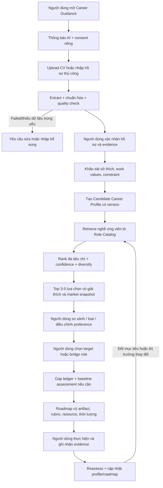

# Phân tích yêu cầu và đề xuất chức năng định hướng nghề nghiệp cá nhân hóa

> Trạng thái: tài liệu làm rõ nghiệp vụ và thiết kế tiền triển khai
> Ngày rà soát: 20/07/2026
> Phạm vi khảo sát: `backend-core/`, `ai-service/`, `frontend/` và các tài liệu trong `docs/`
> Mục tiêu tài liệu: hiểu đúng bài toán trước khi coding; phân biệt rõ phần đã có, phần có thể tái sử dụng và phần phải xây mới.

---

## 1. Kết luận điều hành

Đề xuất “upload CV → phân tích năng lực → đề xuất nghề → chọn nghề mục tiêu → phân tích khoảng cách → sinh roadmap” thực tế không phải một chức năng AI đơn lẻ. Nó là một chuỗi gồm ít nhất năm năng lực sản phẩm:

1. Xây dựng **hồ sơ năng lực hiện tại có bằng chứng** từ CV và xác nhận của người dùng.
2. Hiểu thêm **sở thích nghề nghiệp, giá trị công việc và ràng buộc thực tế** mà CV không thể hiện.
3. Xây dựng **hồ sơ nghề mục tiêu theo cấp bậc và thị trường**, không phụ thuộc vào một JD riêng lẻ.
4. Đề xuất một tập lựa chọn nghề có giải thích, độ tin cậy và đánh đổi; để người dùng tự quyết định mục tiêu.
5. Phân tích gap và tạo roadmap đo lường được, theo dõi được, có thể đánh giá lại.

Định nghĩa sản phẩm nên là:

> **Một hệ thống hỗ trợ người dùng khám phá và lựa chọn hướng nghề nghiệp dựa trên bằng chứng năng lực, sở thích/ràng buộc cá nhân và tín hiệu thị trường lao động có thời điểm; sau đó giúp họ thực thi và kiểm chứng quá trình chuyển dịch đến mục tiêu đã chọn.**

Ba kết luận quan trọng nhất:

- **CV không đủ để kết luận nghề phù hợp.** CV cho biết những gì người dùng đã làm và đã viết ra, không cho biết đầy đủ điều họ thích, giá trị họ coi trọng, khả năng chưa được thể hiện, điều kiện tài chính, vị trí địa lý hay mức sẵn sàng chuyển nghề. Do đó bắt buộc có bước người dùng xác nhận hồ sơ và một khảo sát ngắn.
- **“Nghề mục tiêu” không nên là một tin tuyển dụng.** Phải có `CareerTargetProfile` đại diện cho nghề + cấp bậc + khu vực + thời điểm, được tổng hợp từ taxonomy nghề, nhiều tin tuyển dụng và chuyên gia. Một `JobConfiguration` của một công ty chỉ là một mẫu quan sát.
- **Không để LLM sở hữu nghiệp vụ.** Taxonomy, candidate generation, điều kiện loại, tính điểm thành phần, gap, nguồn học, thời lượng và validator phải được kiểm soát bằng dữ liệu/code. LLM phù hợp với ánh xạ ngữ nghĩa, tổng hợp và diễn đạt trong một schema bị giới hạn.

Đối với đồ án sinh viên năm cuối, phạm vi hợp lý là **một miền nghề nghiệp hẹp** (khuyến nghị Engineering/IT), khoảng 8–12 nghề, 2–3 cấp bậc mỗi nghề, dữ liệu Việt Nam có nguồn và một bộ đánh giá được chấm bởi người có chuyên môn. Làm ít nghề nhưng có ground truth, giải thích, test và theo dõi tiến bộ sẽ thuyết phục hơn một hệ thống tuyên bố tư vấn mọi nghề bằng một prompt.

Nếu chỉ triển khai `CV → prompt → top nghề → prompt → roadmap`, sản phẩm sẽ không “ngon hơn ChatGPT”. Lợi thế có thể bảo vệ trước hội đồng phải đến từ **dữ liệu địa phương, hợp đồng dữ liệu có cấu trúc, bằng chứng truy vết, tính nhất quán, kiểm soát rủi ro, trải nghiệm tương tác và đo được kết quả**, không phải từ việc đặt tên nhiều agent.

---

## 2. Hiểu đúng các khái niệm nghiệp vụ

### 2.1. Phân biệt sáu khái niệm dễ bị trộn lẫn

| Khái niệm | Câu hỏi nó trả lời | Không được hiểu thành |
|---|---|---|
| CV evidence | CV đang thể hiện bằng chứng nào? | Toàn bộ năng lực thật của người dùng |
| Current competency profile | Với dữ liệu đã xác minh, năng lực nào đang ở trạng thái `MET/PARTIAL/NOT_EVIDENCED/UNKNOWN`? | Một điểm số tuyệt đối về con người |
| Career recommendation | Những lựa chọn nghề nào đáng để người dùng khám phá tiếp? | AI quyết định nghề thay người dùng |
| Career readiness | Với một nghề/cấp bậc cụ thể, hồ sơ hiện tại gần yêu cầu đến đâu? | Xác suất chắc chắn được tuyển |
| Skill gap | Khoảng cách giữa evidence hiện tại và chuẩn mục tiêu là gì? | “Không thấy trên CV” đồng nghĩa “không biết” |
| Roadmap | Chuỗi hành động giúp đánh giá, học, thực hành và tạo minh chứng | Cam kết sẽ có việc hoặc thay thế kinh nghiệm thật |

Quy tắc ngôn ngữ bắt buộc:

- Đúng: “CV hiện chưa thể hiện rõ kinh nghiệm triển khai Kubernetes ở production.”
- Sai: “Bạn không biết Kubernetes.”
- Đúng: “Vai trò này đáng để khám phá vì có nhiều kỹ năng chuyển đổi từ backend.”
- Sai: “Đây là nghề hoàn hảo dành cho bạn.”
- Đúng: “Chỉ số sẵn sàng hiện tại dựa trên dữ liệu đã xác minh.”
- Sai: “Bạn có 82% khả năng được tuyển.”

### 2.2. Đây là hỗ trợ quyết định, không phải tiên tri nghề nghiệp

Đầu ra tốt không phải một nghề duy nhất. Hệ thống nên trả 3–5 lựa chọn có chủ đích:

- **Hướng gần:** tận dụng nhiều năng lực hiện tại, chi phí chuyển đổi thấp.
- **Hướng cân bằng:** phù hợp cả năng lực, sở thích và tín hiệu thị trường.
- **Hướng tham vọng:** hấp dẫn nhưng gap lớn hơn, có thể cần một vai trò cầu nối.
- **Hướng không nên ưu tiên hiện tại:** được giải thích bằng ràng buộc hoặc thiếu dữ liệu, không phải phán xét con người.

Người dùng là người chọn `career_goal`. Hệ thống chỉ giúp họ nhìn thấy bằng chứng, đánh đổi và con đường thực thi.

### 2.3. “Cá nhân hóa” phải tạo ra khác biệt thật

Một roadmap chỉ thay tên người dùng trong template không phải cá nhân hóa. Một kết quả được coi là cá nhân hóa khi thay đổi hợp lý theo:

- Evidence và độ mới của evidence trong CV/portfolio/assessment.
- Sở thích công việc và work values do người dùng tự khai.
- Mục tiêu, khu vực, hình thức làm việc và kỳ vọng chuyển nghề.
- Thời gian mỗi tuần, thời hạn, ngân sách, ngôn ngữ và định dạng học.
- Mức độ hiện tại, prerequisite và độ khó của target role.
- Tín hiệu thị trường theo **nguồn + khu vực + cửa sổ thời gian**.
- Tiến độ, artifact và kết quả reassessment trong quá trình thực hiện.

---

## 3. Hiện trạng dự án theo code

### 3.1. Những gì đã có và có giá trị tái sử dụng

| Thành phần | Hiện trạng đọc từ code | Giá trị cho chức năng mới |
|---|---|---|
| CV Extractor | Có pipeline PDF/DOCX, OCR, nhận diện ngôn ngữ, NER/LLM fallback và output có cấu trúc | Tái sử dụng cho bước tạo hồ sơ ban đầu |
| Matcher Agent | Có vector hard-skill matching, LLM evidence matrix và deterministic scoring theo `JobConfiguration` | Tái sử dụng ý tưởng evidence mapping; không tái sử dụng nguyên xi cho xếp hạng nhiều nghề |
| Competency architecture | Backend có `JobFamily`, `CareerLevel`, `Competency`, `CompetencyLevel`, `JobCompetency` | Là nền cho taxonomy nội bộ, nhưng dữ liệu hiện quá mỏng |
| Career Path Agent | Có gap ledger, priority, resource catalog, roadmap skeleton, LLM enrichment, validator, candidate renderer và endpoint riêng | Tái sử dụng lõi gap/roadmap sau khi tách khỏi điều kiện “ứng viên bị reject” |
| Provenance và safety | Career Path hiện loại PII, bảo vệ field deterministic, kiểm resource ID và fail closed | Nên giữ nguyên triết lý cho chức năng mới |
| Hạ tầng | FastAPI, Spring Boot, PostgreSQL/pgvector, RabbitMQ, Redis | Đủ cho MVP; chưa cần thêm một microservice hoặc graph database riêng |

Nguồn code chính:

- [`ai-service/app/agents/extractor_agent/`](../ai-service/app/agents/extractor_agent/)
- [`ai-service/app/agents/matcher_agent/`](../ai-service/app/agents/matcher_agent/)
- [`ai-service/app/agents/career_path_agent/`](../ai-service/app/agents/career_path_agent/)
- [`ai-service/app/core/schemas.py`](../ai-service/app/core/schemas.py)
- [`backend-core/src/main/java/com/tttn/backend_core/entity/`](../backend-core/src/main/java/com/tttn/backend_core/entity/)
- [`backend-core/src/main/resources/db/migration/`](../backend-core/src/main/resources/db/migration/)

### 3.2. Career Path hiện tại không phải Career Recommendation mới

`CareerPathRequest` hiện bắt buộc có:

- `application_id`.
- Một `DecisionSnapshot` cuối cùng.
- `outcome = REJECTED`.
- Reason code nằm trong policy được phép.
- Một target job đã biết.

Trong [`gap_analyzer.py`](../ai-service/app/agents/career_path_agent/gap_analyzer.py), `_is_applicable()` chủ động từ chối nếu decision chưa final hoặc không phải `REJECTED`. Đây là thiết kế đúng cho use case **hỗ trợ ứng viên sau khi trượt một job**, nhưng không phù hợp với use case **người dùng tự khám phá nghề trước khi apply**.

Không nên xóa điều kiện an toàn đó rồi biến endpoint cũ thành endpoint chung. Nên giữ hai facade nghiệp vụ:

1. `RejectionCareerPath`: sau quyết định tuyển dụng, như code hiện tại.
2. `SelfGuidedCareerPlanning`: người dùng chủ động chọn mục tiêu, không có decision tuyển dụng.

Hai facade có thể dùng chung các primitive thuần như `build_gap_ledger`, `prioritize_gaps`, `build_roadmap`, resource catalog và validator.

### 3.3. Các khoảng trống hiện tại ảnh hưởng trực tiếp

1. **Chưa có engine đề xuất nghề.** Matcher chỉ so một CV với một job đã biết.
2. **Chưa có `CareerTargetProfile`.** `JobConfiguration` gắn với một job cụ thể, không đại diện cho chuẩn nghề của thị trường.
3. **Dữ liệu competency chưa đủ.** Seed mới có 7 competency; mô tả level 1–5 mới đầy đủ cho Java/Spring Boot và Python. Hai job mẫu chưa được seed quan hệ competency/family/level đầy đủ.
4. **Không có dữ liệu sở thích và constraint nghề nghiệp.** CV không thể thay thế dữ liệu này.
5. **Không có market-intelligence pipeline.** Chưa có ingestion, deduplication, mapping title/skill, time window hoặc market snapshot.
6. **Backend chưa có domain cho career session/goal/roadmap/progress.** Các repository Job/Application mới cơ bản; chưa có full API workflow cho nghiệp vụ này.
7. **Frontend vẫn là trang Next.js mặc định.** Chưa có candidate journey.
8. **Luồng `/process-application` chưa production-ready.** `application_id` đang dùng filename, `thread_id` cố định, không truyền `job_configuration`, `career_path_node` vẫn placeholder và nhánh human review không resume.
9. **Career Path LLM đang tắt mặc định.** `CAREER_PATH_ENABLED = false`; khi tắt hoặc model thiếu, code chỉ tạo fallback nội bộ bị block delivery.
10. **CV evidence chưa có span/provenance đủ sâu.** Một số evidence là tóm tắt LLM; NER không điền description experience. Không nên suy ra level chắc chắn từ một skill keyword.

### 3.4. Một rủi ro fairness cần tách khỏi chức năng mới

Backend/Matcher hiện có `PedigreeEntity` và bonus theo tier trường/công ty. Dù phục vụ use case tuyển dụng cũ, các biến này **không được đưa vào recommendation score hoặc learning priority** của chức năng định hướng. Trường đã học hay công ty cũ không phải kỹ năng cần “sửa”. Việc dùng tier trường/công ty trong quyết định tuyển dụng cũng nên được nhóm rà soát riêng về tính cần thiết, fairness và chính sách; không nên xem sự tồn tại của migration là bằng chứng nghiệp vụ đã hợp lệ.

### 3.5. Mức độ xác minh hiện trạng

Các kết luận trên đến từ code và test source hiện có. Trong môi trường rà soát này, lệnh test không chạy được vì `pytest` không có trong PATH và `python.exe` không thể được môi trường truy cập. Vì vậy tài liệu không tuyên bố test suite hiện đang pass; cần chạy lại trong môi trường dev/CI trước khi triển khai.

---

## 4. Đối tượng người dùng và phạm vi nên chốt

### 4.1. Persona khuyến nghị cho MVP

**Persona chính:** sinh viên năm cuối và người có 0–3 năm kinh nghiệm trong Engineering/IT tại Việt Nam.

Lý do:

- Phù hợp bối cảnh đồ án và dữ liệu code hiện tại.
- Những người này thường đã có CV/project nhưng chưa chắc target role.
- Có thể xây role catalog đủ sâu cho một miền hẹp.
- Dễ tuyển người dùng thử từ trường/lớp/cộng đồng.
- Có thể mời giảng viên, mentor hoặc kỹ sư làm domain reviewer.

**Persona phụ sau MVP:** người chuyển nghề gần giữa các vai trò IT, ví dụ Backend → DevOps, Data Analyst → Data Engineer.

**Ngoài phạm vi ban đầu:** tư vấn mọi ngành, người chuyển sang nghề có yêu cầu pháp lý/chứng chỉ hành nghề, lãnh đạo cấp cao, tư vấn sức khỏe tâm lý, dự báo lương cá nhân hoặc bảo đảm việc làm.

### 4.2. Bộ nghề pilot đề xuất

Chọn 8 nghề, mỗi nghề ưu tiên `INTERN/FRESHER/JUNIOR`:

1. Backend Developer (Java).
2. Backend Developer (Python).
3. Frontend Developer.
4. QA Automation Engineer.
5. DevOps/Cloud Engineer.
6. Data Analyst.
7. Data Engineer.
8. AI/ML Engineer.

Có thể thêm Business Analyst và UI/UX ở giai đoạn sau khi có SME và taxonomy phù hợp. Không nên tuyên bố hỗ trợ `SALES`, `MARKETING`, `CUSTOMER_SUPPORT` chỉ vì bảng `job_families` đã có tên của các nhóm này.

### 4.3. Phân lớp phạm vi MoSCoW

#### Must have — đồ án phải có

- Consent rõ cho mục đích hướng nghiệp.
- Upload CV và xác nhận/chỉnh sửa hồ sơ đã trích xuất.
- Khảo sát ngắn về sở thích, work values và constraint.
- 3–5 career recommendations có breakdown, evidence và confidence.
- Màn hình so sánh nghề và cho người dùng tự chọn mục tiêu.
- Gap analysis phân biệt `MET/PARTIAL/NOT_EVIDENCED/UNKNOWN`.
- Roadmap theo tuần có activity, artifact, acceptance criteria, giờ/tuần và resource đã kiểm tra.
- Lưu career goal, roadmap, tiến độ và reassessment.
- Bộ evaluation so với baseline, test fairness/safety và audit version.

#### Should have — tạo ấn tượng tốt

- Role “cầu nối” nếu bước nhảy trực tiếp quá lớn.
- Market snapshot theo khu vực/cấp bậc/thời gian và sample size.
- Portfolio evidence hoặc assessment ngắn để giảm `UNKNOWN`.
- What-if: thay target, thời gian hoặc số giờ/tuần và thấy roadmap thay đổi.
- Cho người dùng phản hồi “phù hợp/không phù hợp” kèm lý do.

#### Could have — chỉ làm khi lõi đã đạt quality gate

- Conversational coach bám structured plan.
- Nhắc lịch, streak, gamification.
- Mô phỏng salary range có nguồn và disclaimer.
- Tích hợp LMS/job board chính thức.
- Collaborative mentor review.

#### Won't have trong MVP

- AI tự quyết định nghề thay người dùng.
- Auto-apply việc làm.
- Tư vấn toàn bộ ngành nghề Việt Nam.
- Suy đoán tính cách từ cách viết CV, ảnh, tên, giới tính hoặc trường học.
- “X% chắc chắn được tuyển” hoặc “học xong chắc chắn đạt level”.

---

## 5. Luồng nghiệp vụ mục tiêu



### 5.1. Bước 0 — Minh bạch và consent

UI phải nói rõ:

- Dữ liệu nào được thu thập.
- Mục đích là hướng nghiệp, có tách với mục đích tuyển dụng/talent pool hay không.
- AI hỗ trợ, không đưa ra bảo đảm tuyển dụng.
- Dữ liệu có được gửi tới nhà cung cấp LLM bên ngoài hay không.
- Thời hạn lưu, cách tải xuống, sửa và xóa dữ liệu.

Không gộp checkbox “đồng ý dùng cho hướng nghiệp” với “đồng ý đưa vào talent pool” hoặc marketing.

### 5.2. Bước 1 — Tạo hồ sơ có bằng chứng

Sau upload, hệ thống hiển thị một màn hình review thay vì nhảy thẳng sang recommendation:

- Kỹ năng chuẩn hóa và alias gốc trong CV.
- Experience/project/certification tương ứng.
- Evidence snippet hoặc đường dẫn tới field nguồn.
- Confidence theo field.
- Nút sửa, thêm, xóa và đánh dấu “không đúng”.

Mỗi competency nên có trạng thái:

| Trạng thái | Ý nghĩa | Hành động tiếp theo |
|---|---|---|
| `VERIFIED` | Người dùng xác nhận evidence đúng | Có thể dùng để tính fit |
| `EXTRACTED` | Máy trích xuất nhưng chưa xác nhận | Dùng với confidence thấp hơn |
| `DISPUTED` | Người dùng bác bỏ | Không dùng |
| `SELF_DECLARED` | Người dùng tự thêm, chưa có evidence | Yêu cầu artifact/assessment nếu là gap quan trọng |
| `ASSESSED` | Có kết quả assessment/rubric | Evidence mạnh nhất nếu assessment hợp lệ |

Đối với fresher không có CV tốt, cho phép nhập project/môn học/hoạt động và không phạt vì thiếu lịch sử công việc.

### 5.3. Bước 2 — Thu thập dữ liệu mà CV không có

Khảo sát MVP chỉ nên mất khoảng 5–8 phút, gồm:

- Nhóm hoạt động thích làm: phân tích, xây dựng, giao tiếp, sáng tạo, vận hành, lãnh đạo...
- Work values: thu nhập, ổn định, học hỏi, tự chủ, tác động xã hội, work-life balance.
- Loại công việc không muốn làm.
- Khu vực và remote/hybrid/onsite.
- Mức sẵn sàng chuyển địa điểm.
- Thời gian/tuần, ngân sách, thời hạn mục tiêu.
- Mong muốn tiếp tục hướng hiện tại hay khám phá hướng chuyển đổi.

Có thể tham khảo cấu trúc RIASEC của O*NET Interest Profiler, nhưng không nên tự dịch rồi tuyên bố là trắc nghiệm tâm lý đã được validate tại Việt Nam. Nếu dùng/adapt bộ câu hỏi, phải kiểm tra license, dịch thuật, pilot và ghi đúng phạm vi. O*NET mô tả Interest Profiler là công cụ tự đánh giá để khám phá hoạt động/nghề người dùng thấy hứng thú, không phải phép đo năng lực ([O*NET Interest Profiler](https://www.onetcenter.org/IP.html)).

### 5.4. Bước 3 — Đề xuất nghề

Mỗi recommendation card phải trả lời được:

- Đây là nghề gì và công việc hàng ngày thường gồm những nhiệm vụ nào?
- Tại sao nghề này xuất hiện trong danh sách?
- Evidence nào trong hồ sơ hỗ trợ?
- Sở thích/constraint nào phù hợp hoặc xung đột?
- Mức sẵn sàng hiện tại theo từng chiều, không chỉ một số tổng.
- Gap quan trọng nhất là gì?
- Chi phí chuyển đổi ước lượng là thấp/trung bình/cao và vì sao?
- Tín hiệu thị trường dựa trên bao nhiêu tin, khu vực nào, giai đoạn nào?
- Độ tin cậy và giới hạn dữ liệu là gì?
- Nếu mục tiêu trực tiếp quá xa, role cầu nối nào hợp lý?

Một card tốt có dạng:

```text
DevOps/Cloud Engineer — hướng chuyển đổi gần

Vì sao được đề xuất:
- CV có evidence về Docker, Linux và CI/CD từ project A.
- Người dùng ưu tiên công việc thiên về vận hành hệ thống và tự động hóa.
- 3/5 competency cốt lõi ở mức có evidence; Kubernetes và observability chưa đủ bằng chứng.

Các chiều đánh giá:
- Năng lực hiện tại: 68/100 (confidence: medium)
- Kỹ năng chuyển đổi: 82/100
- Sở thích/work values: 74/100
- Tín hiệu thị trường: 61/100, dựa trên 126 tin đã deduplicate tại HCM/Hà Nội,
  cửa sổ 90 ngày kết thúc 15/07/2026
- Nỗ lực chuyển đổi: medium, 12–16 tuần ở 8 giờ/tuần

Lưu ý: số tin đăng là tín hiệu nhu cầu, không phải số vị trí tuyển thật hay bảo đảm cơ hội.
```

### 5.5. Bước 4 — Người dùng chọn mục tiêu

Người dùng có thể:

- Chọn một target role + level + location.
- Lưu 1–2 nghề để so sánh.
- Chọn role cầu nối.
- Nêu lý do chọn hoặc từ chối recommendation.
- Điều chỉnh constraint và yêu cầu hệ thống xếp hạng lại.

Đây là một sự kiện nghiệp vụ rõ ràng `CAREER_GOAL_SELECTED`, có version và timestamp; không dùng recommendation top 1 làm mục tiêu ngầm định.

### 5.6. Bước 5 — Gap analysis

Gap engine join theo `competency_id`, không chỉ bằng tên/embedding. Với mỗi competency mục tiêu:

- Target level và mô tả hành vi quan sát được.
- Evidence hiện có, nguồn, độ mới và confidence.
- `MET`, `PARTIAL`, `NOT_EVIDENCED`, `UNKNOWN`.
- Current level dạng `nullable` hoặc khoảng ước lượng; không ép số 1–5 nếu thiếu assessment.
- Essential/desirable và prevalence trong market snapshot.
- Prerequisite/dependency.
- Action mode: `ASSESS_FIRST`, `LEARN`, `PRACTICE`, `BUILD_EVIDENCE`.

Nếu target là AI/ML Engineer nhưng gap nền tảng Python/Statistics lớn, hệ thống có thể đề xuất Data Analyst hoặc Python Backend như bridge role tùy evidence và sở thích; không đơn giản tạo một roadmap 12 tuần hứa biến người mới thành AI Engineer.

### 5.7. Bước 6 — Roadmap có thể thực thi và kiểm chứng

Mỗi phase bắt buộc có:

- Outcome gắn với competency/gap ID.
- Prerequisite.
- Hoạt động theo tuần.
- Artifact cụ thể: repository, dashboard, case study, test report, demo, design document...
- Acceptance criteria quan sát được.
- Cách tự đánh giá hoặc assessment.
- Tài nguyên từ catalog đã duyệt, có ngày kiểm tra và mức chi phí.
- Tổng giờ phù hợp `hours_per_week × duration`.
- Checkpoint để quyết định tiếp tục, điều chỉnh hay đánh giá lại.

Ví dụ acceptance criterion tốt:

> “Repository có pipeline CI chạy lint + unit test + build image; README mô tả môi trường test, baseline, lỗi đã gặp và cách khắc phục; người dùng tự chạy lại từ máy sạch theo hướng dẫn.”

Ví dụ không đạt:

> “Hiểu sâu Docker”, “thành thạo Kubernetes”, “đạt chuẩn doanh nghiệp”.

### 5.8. Bước 7 — Theo dõi và reassessment

Roadmap không kết thúc ở việc render Markdown. Người dùng cần:

- Mark activity hoàn thành.
- Gắn link/artifact/evidence mới.
- Tự đánh giá khó khăn và thời gian thực tế.
- Làm checkpoint assessment.
- Nhận roadmap điều chỉnh có version diff.
- Recompute readiness sau 4–6 tuần hoặc khi market profile đổi đáng kể.

Đây là khác biệt sản phẩm lớn so với một lần chat.

---

## 6. Business rules và luồng ngoại lệ

### 6.1. Business rules bắt buộc

- **BR-01:** Không recommendation trước khi người dùng xác nhận các field hồ sơ quan trọng hoặc chấp nhận rõ giới hạn dữ liệu.
- **BR-02:** Không dùng tên, tuổi, giới tính, ảnh, tôn giáo, tình trạng hôn nhân, trường/công ty tier để xếp hạng nghề.
- **BR-03:** `NOT_EVIDENCED` không được render thành “không có năng lực”.
- **BR-04:** Mọi claim về người dùng phải trỏ được tới evidence hoặc self-report đã xác nhận.
- **BR-05:** Mọi claim thị trường phải có source, location, sample size, window và `last_refreshed_at`.
- **BR-06:** Không hiển thị market score nếu sample dưới ngưỡng tin cậy; trả `INSUFFICIENT_MARKET_DATA`.
- **BR-07:** Role catalog và target competency phải có version; roadmap giữ snapshot tại thời điểm sinh.
- **BR-08:** Recommendation score không phải hiring probability và UI phải ghi rõ.
- **BR-09:** Người dùng chọn goal; hệ thống không auto-select top 1.
- **BR-10:** Resource chỉ được hiển thị nếu tồn tại trong catalog, phù hợp level/language/budget và còn hạn kiểm tra.
- **BR-11:** Nếu evidence mâu thuẫn hoặc gap quan trọng ở trạng thái `UNKNOWN`, roadmap bắt đầu bằng assessment.
- **BR-12:** LLM không được sửa role target, gap ID, priority, duration budget, resource ID hoặc provenance.
- **BR-13:** Mỗi plan change phải tạo version mới; không overwrite lịch sử.
- **BR-14:** Dữ liệu dùng cho tuyển dụng, hướng nghiệp và talent pool là các purpose riêng với consent riêng.
- **BR-15:** Cho phép export, chỉnh sửa và yêu cầu xóa hồ sơ/plan theo policy và pháp luật áp dụng.

### 6.2. Luồng ngoại lệ

| Tình huống | Hành vi đúng |
|---|---|
| CV scan hỏng hoặc extraction failed | Yêu cầu file khác/nhập thủ công; không recommendation |
| CV rất ít thông tin | Chuyển sang questionnaire + project/skill self-entry; confidence thấp |
| Skill được user khai nhưng chưa có evidence | Giữ `SELF_DECLARED`; đề xuất assessment/artifact |
| Không đủ market data cho khu vực/level | Hiển thị thiếu dữ liệu; có thể dùng taxonomy fit nhưng không bịa trend |
| Hai nghề có điểm gần nhau | Hiển thị cả hai và giải thích trade-off; không ép thứ hạng giả chính xác |
| Direct target quá xa | Đề xuất bridge role hoặc kéo dài horizon; không nhồi quá tải vào roadmap |
| Tài nguyên học hết hạn/link chết | Loại khỏi output, cảnh báo catalog owner |
| LLM timeout/schema fail | Dùng deterministic result nội bộ; không gửi prose chưa validate |
| CV chứa prompt injection | Xem CV là untrusted data; model không có tool gửi mail/ghi DB/gọi URL tùy ý |
| Người dùng không muốn làm questionnaire | Vẫn cho khám phá theo capability, nhưng preference fit=`UNKNOWN` và giảm confidence |

### 6.3. State machine đề xuất

```text
DRAFT
  → CV_PROCESSING
  → PROFILE_REVIEW_REQUIRED
  → PROFILE_READY
  → PREFERENCE_READY
  → RECOMMENDING
  → RECOMMENDATIONS_READY
  → TARGET_SELECTED
  → GAP_READY
  → ROADMAP_READY
  → ACTIVE
  → REASSESSMENT_DUE

Nhánh lỗi/kiểm soát: NEEDS_INPUT | NEEDS_HUMAN_REVIEW | FAILED | ARCHIVED
```

### 6.4. Actors và trách nhiệm

| Actor | Trách nhiệm/quyền chính |
|---|---|
| Người dùng | Consent, xác nhận hồ sơ, trả lời preference/constraint, chọn target, quyết định dùng hay bỏ recommendation, cung cấp progress/evidence |
| Career/Product Admin | Quản lý policy, questionnaire, consent copy, role availability và rollout |
| Domain SME | Duyệt competency/level/prerequisite, target profile, assessment rubric và các case khó |
| Resource Curator | Duyệt tài nguyên, level/locale/cost, kiểm tra link và freshness |
| Market Data Steward | Quản lý quyền sử dụng nguồn, ingestion, quality, dedup, mapping và snapshot |
| Backend | Source of truth cho user/profile/goal/plan/consent/version/audit; authorization và events |
| AI Service | Extraction, semantic mapping, recommendation, gap/roadmap trong contract; không tự thay đổi domain state |
| Reviewer/Operator | Xử lý `NEEDS_HUMAN_REVIEW`, sửa output có reason và tạo regression case |

### 6.5. Yêu cầu chức năng có mã truy vết

| ID | Yêu cầu | Tiêu chí chấp nhận tóm tắt |
|---|---|---|
| `FR-01` | Quản lý consent theo purpose | Người dùng có thể xem, đồng ý riêng, rút lại và yêu cầu xóa; có audit timestamp/version |
| `FR-02` | Nhận CV PDF/DOCX hoặc hồ sơ nhập tay | Validate type/size/content; lỗi rõ và không chạy recommendation khi input bất hợp lệ |
| `FR-03` | Trích xuất profile | Trả field + evidence + confidence + warning; không chỉ trả một đoạn tóm tắt |
| `FR-04` | Review/correct profile | Người dùng thêm/sửa/bác bỏ evidence; recommendation dùng đúng version đã xác nhận |
| `FR-05` | Thu thập interest/work value/constraint | Có instrument version, skip behavior và confidence effect rõ |
| `FR-06` | Tạo recommendation run | Lưu input/policy/taxonomy/market/model versions và trạng thái async |
| `FR-07` | Trả top-K career options | Mỗi option có component scores, evidence, trade-off, confidence, market provenance và limitations |
| `FR-08` | So sánh/feedback lựa chọn | Người dùng so sánh, loại, lưu và nêu lý do; có thể rerank khi preference đổi |
| `FR-09` | Chọn career goal | Chỉ user action tạo goal; target profile snapshot được cố định |
| `FR-10` | Phân tích gap | Join bằng competency ID; trả `MET/PARTIAL/NOT_EVIDENCED/UNKNOWN` và action mode |
| `FR-11` | Đề xuất bridge role | Chỉ khi direct path vượt policy; giải thích vì sao và cho phép user bỏ qua |
| `FR-12` | Sinh roadmap | Phase/activity/artifact/assessment/resource/time capacity đầy đủ; validator pass |
| `FR-13` | Theo dõi progress/evidence | Lưu activity state, artifact link và evidence mới mà không overwrite lịch sử |
| `FR-14` | Reassessment/versioning | Recompute profile/readiness/roadmap và cho xem thay đổi giữa các version |
| `FR-15` | Human review/admin | Review queue, edit diff, reason, approve/reject, role/resource/source management |
| `FR-16` | Export/delete | Export profile/goal/roadmap; xử lý delete theo authorization/retention policy |

### 6.6. Yêu cầu phi chức năng đề xuất

| ID | Nhóm | Yêu cầu/điểm đo pilot |
|---|---|---|
| `NFR-01` | Privacy | PII tối thiểu; mã hóa; signed URL; không raw CV trong log/prompt trace/eval mặc định |
| `NFR-02` | Security | File validation, untrusted-content isolation, authz theo ownership, secrets ngoài code, output sanitation |
| `NFR-03` | Reliability | Idempotent async jobs, retry có giới hạn, DLQ, không mất state; fail closed khi upstream lỗi |
| `NFR-04` | Reproducibility | Cùng snapshots/policy/model config cho cùng core role IDs, scores và gaps trong tolerance đã định |
| `NFR-05` | Explainability | 100% option có component breakdown; 100% candidate/market claim bắt buộc provenance |
| `NFR-06` | Performance | Acknowledge request < 2 giây; mục tiêu end-to-end p95 < 60 giây cho CV thông thường, cần đo bằng pilot |
| `NFR-07` | Availability | Degrade có kiểm soát khi LLM/market source lỗi; profile và plan đã lưu vẫn xem được |
| `NFR-08` | Observability | Correlation ID, structured logs đã redact, latency/cost/status/version metrics và audit trail |
| `NFR-09` | Accessibility | Keyboard navigation, label/form error rõ, contrast và responsive; kiểm theo WCAG phù hợp phạm vi |
| `NFR-10` | Maintainability | Schema/version policy, migration mới thay vì sửa lịch sử, module boundaries và automated tests |

Các ngưỡng latency/availability là mục tiêu thiết kế ban đầu và phải đo trên hạ tầng thật; không ghi thành SLA production khi chưa benchmark.

---

## 7. Mô hình dữ liệu cốt lõi

### 7.1. `CandidateCareerProfile`

Không truyền nguyên CV vào mọi agent. Backend lưu profile có version và chỉ tạo snapshot allowlist cho AI:

```json
{
  "profile_id": "uuid",
  "user_id": "uuid",
  "version": 3,
  "locale": "vi-VN",
  "competencies": [
    {
      "competency_id": "COMP_DOCKER",
      "state": "VERIFIED",
      "proficiency": {"min": 1, "max": 2, "confidence": 0.71},
      "evidence_refs": ["cv.experience[0].description", "portfolio:repo-123"],
      "last_used_at": "2026-05-01"
    }
  ],
  "interests": {"instrument": "career-interest-v1", "scores": {}},
  "work_values": ["LEARNING", "AUTONOMY"],
  "constraints": {
    "locations": ["HO_CHI_MINH", "REMOTE_VN"],
    "hours_per_week": 8,
    "max_budget": "LOW",
    "target_horizon_months": 6
  },
  "quality": {"grade": "LIMITED", "limitations": []},
  "provenance": {}
}
```

### 7.2. `CareerTargetProfile` — dữ liệu quan trọng nhất còn thiếu

```json
{
  "career_target_id": "VN-IT-DEVOPS-JUNIOR-HCM",
  "version": "2026-Q3-v2",
  "occupation": {
    "title": "DevOps/Cloud Engineer",
    "aliases": ["DevOps Engineer", "Cloud Engineer"],
    "job_family": "ENGINEERING",
    "career_level": "JUNIOR",
    "taxonomy_refs": {"esco_uri": "...", "onet_soc": "..."}
  },
  "scope": {
    "country": "VN",
    "locations": ["HO_CHI_MINH", "HA_NOI", "REMOTE_VN"],
    "window_start": "2026-04-01",
    "window_end": "2026-06-30"
  },
  "competencies": [
    {
      "competency_id": "COMP_DOCKER",
      "target_level": 2,
      "importance": "ESSENTIAL",
      "weight": 0.14,
      "posting_prevalence": 0.63,
      "required_level_description": "..."
    }
  ],
  "typical_tasks": [],
  "entry_requirements": {},
  "adjacent_roles": [],
  "market_snapshot": {
    "deduplicated_posting_count": 126,
    "trend": "STABLE",
    "trend_confidence": "MEDIUM",
    "source_ids": ["internal-jobs", "licensed-feed-a"]
  },
  "review": {"status": "SME_APPROVED", "reviewed_at": "2026-07-10"}
}
```

Target profile được tạo từ ba lớp:

1. **Taxonomy nền:** định danh nghề, skills/tasks chuẩn và quan hệ nghề–skill.
2. **Market layer:** skill prevalence, seniority, location, demand proxy từ nhiều tin tuyển dụng đã deduplicate.
3. **SME layer:** essential/desirable, level description, prerequisite và rubric được người có chuyên môn duyệt.

Không lớp nào thay thế hoàn toàn hai lớp còn lại.

### 7.3. Các aggregate cần lưu ở backend

| Aggregate/bảng | Mục đích |
|---|---|
| `career_profiles` | Hồ sơ nghề nghiệp đã xác nhận và version |
| `competency_evidence` | Evidence source, span/ref, confidence, verification state |
| `career_assessments` | Instrument, answers/scores, version, consent |
| `career_target_profiles` | Hồ sơ nghề/cấp bậc/khu vực có version |
| `career_target_competencies` | Chuẩn competency, level, importance, prevalence |
| `market_snapshots` | Source, window, sample size, freshness, metrics |
| `career_recommendation_runs` | Input versions, policy/model version, status |
| `career_recommendation_items` | Component scores, reasons, rank, confidence |
| `career_goals` | Target người dùng đã chủ động chọn |
| `skill_gap_reports` | Gap ledger theo goal/profile version |
| `career_roadmaps` | Plan version/status/provenance/reviewer |
| `roadmap_phases/activities/progress` | Tiến độ và evidence phát sinh |
| `learning_resources` | Catalog có owner, freshness, locale, level, cost |
| `career_feedback` | Accept/reject reason, usefulness, correction |

Nếu dùng Flyway, chỉ thêm migration `V8+`; không sửa migration cũ đã có thể được áp dụng ở môi trường khác.

---

## 8. Dữ liệu nghề và dữ liệu thị trường

### 8.1. Taxonomy nên dùng như thế nào

Hai nguồn mở có giá trị cho cold start:

- **ESCO** cung cấp occupation/skill concepts, quan hệ occupation–skill, ID ổn định và API/download; ESCO nêu trực tiếp các use case job matching, career guidance và learning management ([ESCO Use/API](https://esco.ec.europa.eu/en/use-esco), [ESCO Web Service API](https://esco.ec.europa.eu/en/use-esco/use-esco-services-api/esco-web-service-api)).
- **O\*NET** có content model gồm interests, skills, knowledge, abilities, tasks, work context và labor-market information; API hỗ trợ hơn 900 occupation ([O\*NET Content Model](https://www.onetcenter.org/content.html), [O\*NET Web Services](https://services.onetcenter.org/about)).

Giới hạn phải ghi rõ:

- O\*NET phản ánh thị trường Mỹ; không dùng salary/outlook của Mỹ để kết luận cho Việt Nam.
- ESCO phản ánh taxonomy châu Âu và hiện không có gói ngôn ngữ tiếng Việt; cần mapping/translation do người Việt review.
- Taxonomy là chuẩn khởi tạo, không phải current Vietnam demand.
- Phải pin `taxonomy_version` để tái lập kết quả.

### 8.2. Market layer Việt Nam

Thứ tự nguồn đề xuất:

1. **Job nội bộ do hệ thống sở hữu/quản lý**: pháp lý rõ nhất nhưng sample nhỏ.
2. **Feed/API hoặc dataset được cấp phép từ job board/đối tác**: tốt nhất cho production.
3. **Nguồn thống kê chính thức**: dùng cho bối cảnh vĩ mô, không thay thế skill-level job postings. Bản tin thị trường lao động của cơ quan Việt Nam có thể cho biết ngành/nghề nhu cầu cao theo kỳ ([Vietnam Labour Market Update Q4/2025](https://english.isos.gov.vn/DATA/ENGLISH/IMAGES/2026/01/26/43924-1019q42025-english_final.pdf)); Cục Thống kê công bố số liệu lao động/việc làm định kỳ ([thông cáo Q2/2026](https://www.nso.gov.vn/tin-tuc-thong-ke/2026/07/thong-cao-bao-chi-ve-tinh-hinh-lao-dong-viec-lam-quy-ii-va-6-thang-dau-nam-2026/)).
4. **Báo cáo doanh nghiệp**: dùng làm tham khảo và triangulation. Báo cáo TopCV 2025–2026 được xây trên khảo sát hơn 3.000 bên và gần 300.000 tin tuyển dụng, nhưng bản đầy đủ có điều kiện truy cập ([TopCV report overview](https://blog.topcv.vn/bao-cao-thi-truong-tuyen-dung-thuong-nien-2025-2026-topcv-viet-nam-chu-dong-truoc-ky-nguyen-nhieu-chuyen-bien/)); Adecco có báo cáo thị trường/lương 2026 thiên về mẫu mid–senior ([Adecco Vietnam Salary Guide 2026](https://www.adecco.com/en-vn/insights/adecco-vietnam-salary-guide-2026)).
5. **Dataset nghiên cứu**: phù hợp benchmark/cold start, không mặc nhiên là feed production. VietJobs 2026 công bố 48.092 tin Việt Nam, 16 nhóm nghề và code/resources mở; cần kiểm tra license, thời điểm thu thập, bias và điều khoản nguồn gốc trước khi sử dụng ([VietJobs paper](https://arxiv.org/abs/2603.05262)).

Không tự ý scrape LinkedIn/TopCV/VietnamWorks rồi đưa vào production nếu chưa kiểm tra ToS, robots, bản quyền cơ sở dữ liệu và quyền tái sử dụng.

### 8.3. Pipeline market intelligence tối thiểu

```text
Source ingestion
→ raw immutable record
→ malware/HTML sanitation
→ language/title/location normalization
→ duplicate & repost detection
→ occupation/level classification
→ skill extraction + taxonomy mapping
→ quality checks
→ aggregation by role × level × location × time window
→ SME review for pilot roles
→ versioned MarketRoleSnapshot
```

Quy tắc MVP đề xuất:

- Cửa sổ rolling 90 ngày, refresh hàng tuần.
- Deduplicate bằng source ID và fingerprint `company + normalized title + location + description`.
- Tách rõ internship/fresher/junior; không gộp senior vào một profile chung.
- Không công bố trend nếu có dưới 30 tin đã deduplicate trong slice; ngưỡng cần calibration.
- Lưu `posting_count`, `source_coverage`, `freshness`, missing-rate và classification confidence.
- Gọi posting count là **demand proxy**, không gọi là số người thực tuyển.
- Một skill phổ biến không tự động là essential; cần rule/SME và phân biệt “required” với boilerplate.

Nghiên cứu về job transition cho thấy kết hợp skill distance với dữ liệu cung/cầu, lương, giáo dục và kinh nghiệm dự báo transition tốt hơn chỉ dùng khoảng cách skill; đồng thời nhấn mạnh thị trường mang tính địa phương/thời điểm và output nên mang tính mô tả, không áp đặt vì dữ liệu lịch sử có bias ([Dawson et al., PLOS ONE](https://journals.plos.org/plosone/article?id=10.1371/journal.pone.0254722)). Đây là cơ sở tốt cho thiết kế đa tín hiệu và giữ quyền tự chủ cho người dùng.

---

## 9. Thiết kế recommendation engine

### 9.1. Không dùng một LLM call để xếp hạng nghề

Kiến trúc phù hợp:

```text
Candidate Profile + Preferences + Constraints
                  │
                  ▼
       1. Eligibility / hard filters
                  ▼
       2. Candidate generation
          taxonomy graph + embedding retrieval
                  ▼
       3. Deterministic feature computation
          capability, transferability, preference,
          market, feasibility, data quality
                  ▼
       4. Transparent rank + diversification
                  ▼
       5. LLM grounded explanation
                  ▼
       6. Schema / evidence / policy validator
                  ▼
       Top-K recommendations + component scores
```

### 9.2. Candidate generation

Kết hợp:

- Exact/alias mapping từ competency profile sang taxonomy skills.
- Graph neighbor: nghề có nhiều transferable skills.
- Embedding similarity giữa evidence/skills và role tasks/competencies.
- Adjacent-role links đã được SME duyệt.
- Filter theo location, education/license bắt buộc, level và điều người dùng loại trừ.

Mục tiêu candidate generation là recall cao, ví dụ lấy 20–30 nghề ứng viên trước khi rank. Không để vector similarity cuối cùng quyết định top 5.

### 9.3. Tính điểm đa chiều

Đề xuất giữ các chiều độc lập trong UI:

| Chiều | Nội dung | Nguồn |
|---|---|---|
| `capability_readiness` | Mức bao phủ competency mục tiêu bằng evidence | Profile + target competency |
| `skill_transferability` | Kỹ năng hiện có chuyển sang tasks mục tiêu tốt đến đâu | Taxonomy/skill graph + market co-occurrence |
| `interest_value_fit` | Sở thích/work values tương hợp | Questionnaire đã version |
| `market_opportunity` | Demand proxy, trend, location/level availability | Market snapshot |
| `transition_feasibility` | Gap, prerequisite, thời gian, ngân sách, constraint | Gap engine + user constraint |
| `recommendation_confidence` | Độ đầy đủ/chất lượng của toàn bộ dữ liệu | Data quality/provenance |

Có thể dùng score tổng để sort nội bộ, ví dụ ban đầu:

```text
ranking_score =
    0.35 × capability_readiness
  + 0.20 × skill_transferability
  + 0.20 × interest_value_fit
  + 0.15 × market_opportunity
  + 0.10 × transition_feasibility
```

Nhưng đây chỉ là **policy baseline cần SME/user research phê duyệt**, không phải công thức khoa học đã được codebase chứng minh. Các nguyên tắc:

- Nếu người dùng không làm questionnaire, không tự gán `interest_value_fit = 50`; đánh dấu `UNKNOWN`, re-normalize các trọng số còn lại và hạ confidence.
- Essential gap có thể áp dụng penalty/gate riêng, không để bị che bởi market score cao.
- Confidence không cộng vào fit; nó nói mức độ nên tin fit.
- Hiển thị component scores và lý do; không chỉ hiện `86% phù hợp`.
- Cho người dùng thay đổi ưu tiên, ví dụ “ưu tiên ổn định hơn thu nhập”, để rank thay đổi có thể giải thích.

### 9.4. Level estimation phải thận trọng

Skill xuất hiện trong CV không đủ suy ra level. Mô hình nên lưu:

- `observed_level: null | {min, max}`.
- `evidence_strength`.
- `confidence`.
- `assessment_required`.

Chỉ gán level hẹp khi target description có hành vi quan sát được và evidence/assessment đủ để đối chiếu. Cách làm hiện tại của Career Path — không tự suy ra `observed_level` từ boolean — là một điểm tốt nên giữ.

### 9.5. Diversification

Top 5 không nên là năm biến thể gần như giống nhau. Sau rank, áp dụng rule đơn giản:

- Tối đa 2 role cùng một sub-family.
- Có ít nhất một near-term và một aspirational option nếu đủ điều kiện.
- Không đưa aspirational role nếu essential prerequisites vượt ngoài horizon và không có bridge path.
- Giữ lý do loại để audit.

### 9.6. Vai trò của LLM

LLM được phép:

- Map ngôn ngữ tự do sang competency/taxonomy candidate.
- Tóm tắt evidence với reference.
- Giải thích trade-off từ component scores có sẵn.
- Viết candidate-facing roadmap trong skeleton đã khóa.

LLM không được phép:

- Tự tạo role/skill/market statistic/source URL.
- Tự tính hiring probability.
- Tự thay weight hoặc hard filter.
- Suy đoán sở thích/tính cách từ CV.
- Sửa target/gap/resource/provenance.
- Gọi web, gửi email hoặc ghi DB tùy ý.

NIST mô tả confabulation là hiện tượng mô hình tạo và trình bày nội dung sai một cách tự tin; đây là lý do market facts, link học và số liệu không được lấy từ trí nhớ mô hình ([NIST Generative AI Profile](https://nvlpubs.nist.gov/nistpubs/ai/NIST.AI.600-1.pdf)).

---

## 10. Kiến trúc phù hợp với codebase

### 10.1. Không cần thêm microservice trong MVP

Giữ ba khối hiện tại:

- **Next.js:** onboarding, profile review, questionnaire, compare roles, roadmap/progress.
- **Spring Boot:** auth, consent, file metadata/object URL, source of truth cho profile/goal/plan/progress, API và domain events.
- **Python FastAPI:** extraction, semantic mapping, recommendation, gap/roadmap, evaluation hooks.

PostgreSQL/pgvector đủ cho role catalog + embedding + structured relationship ở quy mô đồ án. Chỉ cân nhắc Neo4j khi có graph rất lớn và query path phức tạp đã đo được; thêm công nghệ để “trông multi-agent” không tạo chất lượng.

### 10.2. Module Python mới

```text
ai-service/app/agents/career_recommender_agent/
├── profile_adapter.py          # allowlist, bỏ PII, merge user corrections
├── taxonomy_mapper.py          # alias/ESCO/O*NET/internal competency mapping
├── candidate_retriever.py      # role candidates, high recall
├── feature_engine.py           # component scores deterministic
├── ranking_engine.py           # policy version, filters, diversify
├── market_snapshot_reader.py   # read-only snapshot, no live arbitrary web
├── explanation_renderer.py     # LLM/templated grounded explanation
├── recommendation_validator.py # evidence, source, score, privacy checks
└── agent.py                    # facade/orchestration
```

Market ETL nên là một package/job riêng trong `ai-service/app/market_intelligence/`, chạy theo schedule hoặc admin command; không để request người dùng chờ crawler.

### 10.3. Tái cấu trúc Career Path an toàn

Trong `career_path_agent`:

1. Tách `_is_applicable()` ra facade rejection-specific.
2. Tách hàm thuần `build_gap_ledger(candidate_snapshot, target_snapshot, evidence)`.
3. Giữ `RejectionCareerPathRequest` với decision gate hiện tại.
4. Thêm `SelfGuidedRoadmapRequest` yêu cầu `career_goal_id` do user chọn.
5. Dùng chung priority/resource/roadmap/validator nhưng có policy version riêng.
6. Không cho self-guided output nhìn thấy rejection reason, HR recommendation, score hoặc pedigree.

### 10.4. API đề xuất

Public/backend API:

```text
POST   /api/career-sessions
POST   /api/career-sessions/{id}/cv
GET    /api/career-sessions/{id}/profile
PATCH  /api/career-sessions/{id}/profile
PUT    /api/career-sessions/{id}/preferences
POST   /api/career-sessions/{id}/recommendation-runs
GET    /api/career-sessions/{id}/recommendations/{runId}
POST   /api/career-sessions/{id}/goals
POST   /api/career-goals/{goalId}/gap-analyses
POST   /api/career-goals/{goalId}/roadmaps
PATCH  /api/career-roadmaps/{id}/activities/{activityId}
POST   /api/career-roadmaps/{id}/reassessments
DELETE /api/career-sessions/{id}
```

Internal AI API:

```text
POST /internal/career/profile/analyze
POST /internal/career/recommend
POST /internal/career/gaps/analyze
POST /internal/career/roadmaps/generate
```

Các request dài nên trả `202 Accepted + operation_id`, backend publish event và frontend poll/SSE. REST đồng bộ có thể giữ cho test/dev, nhưng production-like flow không nên giữ HTTP mở trong lúc OCR + embeddings + LLM chạy hàng chục giây.

### 10.5. Event đề xuất

```text
CAREER_CV_UPLOADED
→ CAREER_PROFILE_EXTRACTED
→ CAREER_PROFILE_CONFIRMED
→ CAREER_RECOMMENDATION_REQUESTED
→ CAREER_RECOMMENDATIONS_READY | CAREER_RECOMMENDATION_FAILED
→ CAREER_GOAL_SELECTED
→ CAREER_GAP_READY
→ CAREER_ROADMAP_READY
→ CAREER_EVIDENCE_ADDED
→ CAREER_REASSESSMENT_DUE
```

Mỗi message có `event_id`, `correlation_id`, `user_id`, aggregate ID/version, idempotency key, occurred_at, schema version; không dùng filename làm identity và không dùng một LangGraph thread ID cho mọi người.

### 10.6. Frontend journey nên trình diễn

1. Consent + upload.
2. Profile review với evidence chips bấm được.
3. Questionnaire ngắn, có progress.
4. Recommendation cards và compare view.
5. “Vì sao có kết quả này?” với component breakdown/source/time.
6. Chọn target/bridge role.
7. Gap map: strengths, assess-first, core growth, supporting.
8. Roadmap timeline và artifact checklist.
9. Progress/reassessment và version diff.

Đây là nơi hội đồng thấy hệ thống là một sản phẩm, không chỉ là một JSON API.

---

## 11. Chức năng này có thể tốt hơn ChatGPT như thế nào?

### 11.1. Câu trả lời trung thực

Nó **không mặc nhiên tốt hơn ChatGPT**. Một frontier model có thể viết lời tư vấn rất hay từ CV và hội thoại dài. Nếu hệ thống này chỉ bọc cùng loại model bằng UI, output có thể kém hơn do thiếu context và prompt nghèo hơn.

Hệ thống chỉ tốt hơn trong một nhiệm vụ được định nghĩa rõ nếu xây được các lợi thế sau:

| Khía cạnh | ChatGPT + upload CV thông thường | Hệ thống đề xuất |
|---|---|---|
| Nguồn nghề | Kiến thức model/web tùy phiên | Role catalog có version và SME review |
| Thị trường Việt Nam | Có thể chung chung hoặc không ổn định theo phiên | Snapshot local, source/window/sample/freshness rõ |
| Sở thích/constraint | Phụ thuộc người dùng nhớ cung cấp trong chat | Onboarding có cấu trúc, lưu và cho sửa |
| Evidence | Có thể giải thích nhưng không bắt buộc trỏ field | Claim bắt buộc có evidence reference |
| Xếp hạng | Khó biết model đã cân các yếu tố thế nào | Component score + policy version + trade-off |
| “Không thấy trong CV” | Có nguy cơ suy diễn | Trạng thái `NOT_EVIDENCED/UNKNOWN` và assess-first |
| Tính nhất quán | Có thể đổi giữa các lần chat | Deterministic core + versioned snapshot |
| Nguồn học | Có thể bịa/link cũ | Curated catalog và last-verified date |
| Theo dõi | Chủ yếu phụ thuộc lịch sử chat | Goal/plan/progress/evidence/reassessment là domain data |
| Đổi mục tiêu | Phải cung cấp lại context | Recompute trên cùng profile, so sánh version |
| Privacy/audit | Theo chính sách nền tảng chung | Consent theo purpose, retention, audit riêng của sản phẩm |
| Đánh giá chất lượng | Người dùng tự cảm nhận | Golden set, SME rubric, safety/fairness test, outcome metric |

Lợi thế cạnh tranh không phải “multi-agent”. Lợi thế là vòng lặp:

```text
evidence thật → lựa chọn có nguồn → user quyết định
→ hành động tạo artifact → reassessment → profile tốt hơn
```

### 11.2. Cách chứng minh thay vì tuyên bố

Thiết kế benchmark mù:

1. **B0 — Generic ChatGPT:** CV + câu hỏi gốc của người dùng.
2. **B1 — Strong ChatGPT:** CV + preference/constraint có cấu trúc.
3. **B2 — Retrieval baseline:** embedding similarity CV ↔ role profiles.
4. **B3 — Deterministic baseline:** weighted skill coverage.
5. **System:** hybrid pipeline đề xuất trong tài liệu.

Trên cùng 100–150 case đã ẩn danh/được consent:

- Hai SME/career reviewer chấm độc lập, reviewer không biết output thuộc hệ thống nào.
- Người dùng thật pairwise chọn output hữu ích hơn và ghi lý do.
- Đánh giá relevance của top 5, groundedness, market correctness, uncertainty, actionability, feasibility, privacy/safety và repeatability.
- Adjudicate disagreement; theo dõi inter-rater agreement.

Chỉ được nói “tốt hơn ChatGPT trong use case X” nếu kết quả có dữ liệu, ví dụ tỷ lệ pairwise win và confidence interval đủ thuyết phục, đồng thời safety/groundedness không giảm. Không dùng một ví dụ đẹp để kết luận tổng quát.

### 11.3. Demo hội đồng nên cho thấy gì

- Một CV bị extractor hiểu sai và người dùng sửa; recommendation thay đổi có lý do.
- Evidence chip trỏ về đúng project/experience.
- Hai nghề điểm gần nhau nhưng trade-off khác nhau.
- Market statistic có ngày, source và sample size.
- Một skill thiếu evidence được chuyển thành `ASSESS_FIRST`, không phán người dùng yếu.
- Target quá xa sinh bridge role thay vì roadmap phi thực tế.
- Roadmap tạo artifact/rubric, sau khi thêm artifact readiness thay đổi.
- Cùng input chạy lại giữ nguyên role/gap cốt lõi dù cách diễn đạt LLM có thể thay đổi.
- Một bảng benchmark với ChatGPT/embedding baseline và các failure case.

---

## 12. Chiến lược đánh giá nghiêm túc

### 12.1. Evaluation dataset

MVP nên có 120–150 case trong miền IT, không cần hàng nghìn CV nếu annotation có chất lượng. Mỗi case gồm:

- CV/profile đã ẩn danh và quyền sử dụng rõ.
- User corrections.
- Preference/constraint answers.
- Tập career options được SME coi là `HIGHLY_RELEVANT/ACCEPTABLE/WEAK/UNSUITABLE`.
- Evidence mapping chuẩn.
- Gap quan trọng cho ít nhất một target.
- Forbidden claims.
- Roadmap rubric và reviewer notes.

Phân tầng theo:

- Fresher vs 1–3 năm kinh nghiệm.
- CV Việt/Anh; extraction success/partial.
- Các sub-family nghề.
- Profile rõ vs thiếu/mâu thuẫn.
- Constraint khác nhau.
- Direct vs bridge transition.
- Prompt injection và PII.

Mỗi case nên có hai annotator; disagreement do SME thứ ba adjudicate. 120–150 case là quy mô pilot/đồ án, không phải bằng chứng production cho toàn thị trường.

### 12.2. Metric theo tầng

#### Profile extraction/evidence

- Precision/Recall/F1 theo field quan trọng.
- Evidence-span precision.
- Taxonomy mapping accuracy và top-k recall.
- User correction rate.
- Confidence calibration (`ECE`/Brier nếu đủ sample).

#### Career recommendation

- `Recall@5`: top 5 có chứa các option SME chấp nhận không.
- `nDCG@5`: thứ tự có ưu tiên đúng mức relevance không.
- Coverage và diversity theo role family.
- Constraint violation rate — mục tiêu 0 trên hard constraints.
- Recommendation stability trên repeated run.
- `acceptable_option_rate`: tỷ lệ case có ít nhất một lựa chọn được cả SME và user chấp nhận.
- User pairwise preference so với baseline.

#### Explanation và market grounding

- `grounded_claim_precision`.
- Source/window/sample completeness.
- Market fact accuracy.
- Unsupported claim count.
- Explanation helpfulness/clarity do user chấm.

#### Gap/roadmap

- Critical gap precision/recall.
- Tỷ lệ `NOT_EVIDENCED` bị diễn đạt sai thành “không có năng lực” — mục tiêu 0.
- Critical gap coverage trong roadmap.
- Artifact + measurable acceptance completeness.
- Resource validity/freshness.
- Workload feasibility.
- SME rubric: correctness, sequencing, actionability, personalization, safety.

#### Outcome

- Target selection rate sau khi xem compare view.
- Roadmap activation và week-4 retention.
- Milestone completion có artifact.
- Reassessment delta theo competency.
- Tỷ lệ đổi target và lý do.
- Complaint/correction/override rate.

Không dùng số người được tuyển làm metric duy nhất vì bị ảnh hưởng bởi headcount, cạnh tranh, phỏng vấn và kinh tế. Không dùng BLEU/ROUGE để kết luận roadmap tốt.

### 12.3. Release gate ban đầu đề xuất

Các con số sau là mục tiêu quản trị để bắt đầu calibration, không phải thành tích hiện tại:

| Gate | Mục tiêu pilot |
|---|---|
| Schema/reference/hard-constraint invariants | 100% |
| Unsupported market statistic/URL | 0 case |
| Grounded candidate-claim precision | ≥ 98% |
| Top-5 chứa ít nhất một SME-acceptable role | ≥ 85% |
| Critical gap coverage | 100% trên case đủ dữ liệu |
| Resource validity tại release | 100% |
| Prompt-injection critical suite | 100% fail-safe |
| Counterfactual PII/name/gender consistency | 100% cho critical ranking/gap |
| SME correctness/actionability/feasibility | Trung bình ≥ 4/5, không critical case < 3 |
| Material edit rate trong shadow review | ≤ 15% trước limited rollout |

Không tối ưu một metric tổng rồi che lỗi slice. Báo cáo riêng cho language, experience level, role family và extraction quality.

### 12.4. Các lớp test

1. Unit: mapping, dedup, feature, formula, filters, gap, duration, resource.
2. Contract/property: schema, enum, ID, version, idempotency, invariant.
3. Golden-set offline eval.
4. Metamorphic: đổi tên/giới tính/ảnh/địa chỉ không làm đổi core recommendation khi evidence/constraint giữ nguyên.
5. Adversarial: prompt injection trong CV/JD/resource, malformed PDF, malicious URL.
6. Repeatability: core role IDs, component score, gap IDs ổn định.
7. Integration: upload → profile review → recommend → goal → gap → roadmap → progress.
8. Shadow: reviewer duyệt 100%, lưu edit diff.
9. Online monitoring: drift, stale source, no-result, correction, latency, cost, safety.

---

## 13. Privacy, safety và fairness

### 13.1. Nghĩa vụ thực tế với CV

Luật Bảo vệ dữ liệu cá nhân số 91/2025/QH15 có hiệu lực từ 01/01/2026 ([Công báo Chính phủ](https://congbao.chinhphu.vn/van-ban/luat-so-91-2025-qh15-45578.htm)). Cổng Chính phủ nêu riêng trong tuyển dụng: chỉ yêu cầu thông tin phục vụ mục đích tuyển dụng, xử lý cần sự đồng ý và phải xóa/hủy thông tin người không được tuyển trừ khi có thỏa thuận khác ([tóm tắt quy định tuyển dụng](https://xaydungchinhsach.chinhphu.vn/doanh-nghiep-phai-xoa-du-lieu-ca-nhan-nguoi-lao-dong-khi-cham-dut-hop-dong-119250728094419409.htm)).

Đối với chức năng này:

- “Hướng nghiệp” là purpose riêng với “apply job” và “talent pool”.
- Consent phải cụ thể, có thể kiểm chứng và có cơ chế rút lại.
- Có retention policy; không giữ raw CV vô thời hạn.
- Có export/correct/delete flow.
- Mã hóa khi truyền/lưu, signed URL ngắn hạn, least privilege.
- Không log raw CV/PII vào trace, prompt log hoặc evaluation dataset.
- Nếu gọi LLM API ngoài Việt Nam, cần đánh giá nhà cung cấp, data retention, training setting và chuyển dữ liệu xuyên biên giới; nhờ người có chuyên môn pháp lý xác nhận trước production.
- Tách `career_guidance_consent`, `recruitment_consent`, `talent_pool_consent`, `research/evaluation_consent`.

Đây là định hướng kỹ thuật/nghiệp vụ, không thay thế tư vấn pháp lý.

### 13.2. Prompt injection và untrusted content

- PDF/DOCX, CV text, JD và resource description đều là untrusted data.
- Planner không có quyền ghi DB, gửi notification hoặc gọi URL.
- Dùng structured allowlist, giới hạn độ dài, sanitize control chars/PII.
- URL/resources đến từ catalog; không để model tự browse trong request path.
- Validate output trước persistence và trước render HTML.
- Quarantine file bất thường; cân nhắc antivirus cho upload production.
- Red-team instruction chia nhỏ qua nhiều section của CV.

### 13.3. Fairness

- Bỏ ảnh, tên, giới tính, tuổi, ngày sinh, tình trạng hôn nhân, tôn giáo và pedigree khỏi ranking features.
- Không suy đoán interest/personality từ demographic hoặc cách viết.
- Chạy counterfactual tests.
- Theo dõi performance theo slice nhưng hạn chế truy cập protected attributes và chỉ thu thập khi có cơ sở/consent phù hợp.
- Không học trực tiếp “người trước đây chuyển nghề nào” rồi coi đó là đường đúng; dữ liệu lịch sử phản ánh bất bình đẳng.
- Market popularity không được khóa người dùng vào nghề phổ biến; phải có diversity và quyền điều chỉnh mục tiêu.
- Recommendation là descriptive decision aid; user có thể bỏ qua, sửa preference và chọn nghề ngoài top list.

NIST AI RMF nhấn mạnh hệ thống đáng tin cần valid/reliable, accountable/transparent, explainable, privacy-enhanced và fair với harmful bias được quản lý ([NIST AI RMF](https://www.nist.gov/publications/artificial-intelligence-risk-management-framework-ai-rmf-10)). Nếu sau này hệ thống được dùng để sàng lọc tuyển dụng thay vì chỉ hướng nghiệp, mức rủi ro tăng đáng kể; EU AI Act liệt kê AI cho employment như CV sorting vào nhóm high-risk và yêu cầu risk management/human oversight theo phạm vi áp dụng ([EU AI Act overview](https://digital-strategy.ec.europa.eu/en/policies/regulatory-framework-ai)).

---

## 14. Kế hoạch triển khai thực tế cho đồ án

### Giai đoạn 0 — Chốt nghiệp vụ và nguồn dữ liệu (1–2 tuần)

- Chốt persona, 8 role, level, location và mục tiêu sản phẩm.
- Chốt nguồn market data có quyền sử dụng.
- Chốt consent/retention và AI disclaimer.
- Mời ít nhất 2 SME/reviewer.
- Chốt questionnaire và resource policy.

**Exit gate:** mọi trường dữ liệu/weight/policy có owner; không còn câu hỏi P0 chưa quyết định.

### Giai đoạn 1 — Role catalog và evaluation seed (2–3 tuần)

- Import subset ESCO/O\*NET; xây internal competency IDs và Vietnamese aliases.
- Xây 8 × 2–3 role-level profiles.
- Market ETL + dedup + snapshot cho pilot.
- SME duyệt essential/desirable/level/prerequisite.
- Tạo 30–50 case seed đầu tiên.

**Exit gate:** target profiles có version, nguồn, sample, review; mapping test đạt ngưỡng seed.

### Giai đoạn 2 — Career profile experience (2 tuần)

- Backend aggregate/migration/API.
- Upload → extraction → profile review/edit.
- Evidence verification states.
- Questionnaire + constraints.

**Exit gate:** người dùng có thể tạo profile không phụ thuộc CV hoàn hảo; PII không vào planner snapshot.

### Giai đoạn 3 — Recommendation core (2–3 tuần)

- Candidate retrieval.
- Deterministic feature/rank/diversify.
- Component explanation template trước, LLM enrichment sau.
- Recommendation validator.
- Compare UI + target selection.

**Exit gate:** baseline metrics và hard invariants đạt trên seed set; cùng input ổn định.

### Giai đoạn 4 — Gap và roadmap self-guided (2–3 tuần)

- Refactor gap primitive khỏi rejection gate.
- Self-guided contract/facade.
- Bridge-role rule.
- Roadmap/resource reuse và progress domain.
- What-if hours/week/horizon.

**Exit gate:** roadmap bao phủ gap core, đúng capacity, resource hợp lệ; rejection use case cũ không regression.

### Giai đoạn 5 — Evaluation, hardening và hoàn thiện UX (3–4 tuần)

- Mở rộng golden set lên 120–150 case.
- Blind comparison với ChatGPT/baselines.
- Security/fairness/metamorphic tests.
- Shadow SME review, edit diff.
- Monitoring, latency/cost, demo failure modes.

**Exit gate:** báo cáo metric theo slice, risk register, limitation và reproducible demo.

Tổng thời gian hợp lý: khoảng 12–17 tuần tùy số thành viên và khả năng thu thập/annotation dữ liệu. Phần dễ trễ nhất không phải code LLM mà là role catalog, market data và expert evaluation.

### 14.1. Thứ tự PR khuyến nghị

1. Contract + migrations + consent/profile domain.
2. Target role catalog + market snapshot schema/ETL.
3. Profile review + questionnaire.
4. Candidate retrieval + deterministic feature/ranking tests.
5. Explanation/validator + recommendation API/UI.
6. Gap-core refactor + self-guided facade.
7. Roadmap/progress/reassessment.
8. Offline eval + fairness/security + observability.

Không tích hợp thẳng vào `orchestrator.py` hiện tại trước khi standalone contracts pass; nếu không sẽ khó phân biệt lỗi extraction, recommendation, decision gate và graph state.

---

## 15. Những câu hỏi cần Product/BA/SME trả lời

Các câu hỏi dưới đây không cản trở việc hiểu bài toán; cột cuối là default mình đề xuất để dự án có thể tiến lên.

### 15.1. Quyết định P0 — phải chốt trước implementation tương ứng

| # | Câu hỏi | Vì sao quan trọng | Default đề xuất |
|---:|---|---|---|
| 1 | Người dùng chính là ai? | Thay đổi role catalog, UI, validation | Sinh viên năm cuối + 0–3 năm IT |
| 2 | Hỗ trợ những nghề/cấp bậc nào? | Không thể có quality cho “mọi nghề” | 8 role IT, Intern/Fresher/Junior |
| 3 | Thị trường nào? | Demand/salary/role names mang tính địa phương | Việt Nam; HCM, Hà Nội, Remote VN |
| 4 | Nguồn job postings nào có quyền sử dụng? | Không có nguồn thì market claim không hợp lệ | Internal jobs + nguồn licensed; dataset nghiên cứu chỉ benchmark |
| 5 | Ai sở hữu role/competency/level definition? | LLM không thể là business owner | 1 SME tech + 1 giảng viên/mentor, review theo quý |
| 6 | Có bắt buộc questionnaire không? | CV không thể hiện interest/work values | Bắt buộc 8–12 câu core; có thể skip với confidence thấp |
| 7 | Người dùng có được sửa profile không? | Extraction chắc chắn có lỗi | Bắt buộc review/edit trước recommend |
| 8 | Có hiển thị score tổng không? | Magic score dễ gây hiểu nhầm | Chỉ dùng để sort; UI ưu tiên component + band/confidence |
| 9 | Ai chọn target? | Tránh AI quyết định thay user | Người dùng xác nhận rõ |
| 10 | Roadmap mặc định bao lâu/giờ tuần? | Ảnh hưởng tính khả thi | 12 tuần, 6–8 giờ/tuần; cho điều chỉnh |
| 11 | Tài nguyên học lấy từ đâu và ai kiểm tra? | Tránh hallucinated/dead links | Catalog 30–50 resource pilot, verify mỗi 90 ngày |
| 12 | Khi nào phải human review? | Quản trị rủi ro | Low data, essential UNKNOWN, aspirational jump, model/version mới |
| 13 | Retention raw CV/profile/plan? | Pháp lý và niềm tin | Raw CV ngắn hạn; profile/plan theo consent; có delete flow |
| 14 | Dữ liệu có được dùng cho tuyển dụng/talent pool không? | Purpose khác nhau | Không mặc định; consent riêng, opt-in |
| 15 | Tiêu chí thành công của đồ án? | Tránh chỉ demo UI | Top-k relevance + groundedness + roadmap rubric + user study |

### 15.2. Câu hỏi P1 — cần chốt trước pilot

1. Dùng/adapt instrument sở thích nào và đã kiểm tra license/dịch thuật chưa?
2. Có cho upload portfolio/GitHub/chứng chỉ không; cách xác minh evidence?
3. Market snapshot refresh theo tuần hay tháng; sample threshold theo role?
4. Có hiển thị salary không; nguồn, level/location và disclaimer nào?
5. Bridge role được sinh bằng rule, SME graph hay model?
6. Khi người dùng chọn nghề ngoài top list, hệ thống có role profile không?
7. Soft-skill assessment nào đủ tin cậy, ai review?
8. Có accessibility requirement cho questionnaire/roadmap không?
9. Reviewer edit có được dùng làm training data không; consent và version thế nào?
10. Notification/progress reminder là opt-in hay mặc định?

### 15.3. Các giả định đề xuất để viết backlog ban đầu

- Sản phẩm B2C/self-guided, nhưng tận dụng dữ liệu job nội bộ.
- Không có quyết định tuyển dụng trong luồng recommendation.
- Không dùng pedigree, ảnh hoặc demographic.
- Chỉ hỗ trợ tiếng Việt UI; chấp nhận CV Việt/Anh; role catalog có alias Việt/Anh.
- Không hứa real-time market; dùng snapshot refresh hàng tuần và hiển thị ngày.
- Không fine-tune model trong MVP; ưu tiên hybrid retrieval/rule/LLM + evaluation.
- LLM provider là replaceable dependency; model/prompt/schema đều versioned.
- Mọi plan ban đầu ở `DRAFT/REVIEW_REQUIRED` cho đến khi evaluation gate đạt.

---

## 16. Rủi ro và cách kiểm soát

| Rủi ro | Hậu quả | Kiểm soát |
|---|---|---|
| CV nghèo/không đúng | Recommend sai nhưng tự tin | Profile review, questionnaire, confidence, assess-first |
| Taxonomy ngoại không hợp Việt Nam | Role/skill lệch ngữ cảnh | Vietnamese alias + market layer + SME review |
| Một JD chi phối target | Roadmap quá đặc thù công ty | Aggregate nhiều JD, prevalence, role snapshot |
| Job data cũ/trùng/ghost | Market trend sai | Dedup, freshness, multi-source, sample/source disclosure |
| Popularity bias | Chỉ đề xuất nghề “hot” | Multi-objective, diversity, user preference, no market-only rank |
| Historical bias | Thu hẹp cơ hội nhóm yếu thế | Descriptive use, counterfactual tests, no protected features |
| LLM hallucination | Bịa năng lực, nguồn, roadmap | Structured input/output, protected fields, catalog, validators |
| Resource rot | Roadmap không dùng được | Owner, last_verified, automated link check + manual review |
| Scope quá rộng | Đồ án có nhiều màn nhưng không có chất lượng | 8 role pilot, DoD theo metric |
| Không có ground truth | Không chứng minh hơn ChatGPT | Expert labels, blind baseline comparison, user study |
| Privacy violation | Mất niềm tin/rủi ro pháp lý | Purpose consent, minimization, encryption, delete/retention |
| “Agent theater” | Kiến trúc phức tạp không có giá trị | Module theo responsibility, trace và test; thêm agent chỉ khi có boundary rõ |

WEF báo cáo rằng doanh nghiệp kỳ vọng 39% core skills thay đổi đến 2030; điều này ủng hộ role/market snapshot có version và reassessment, thay vì roadmap tĩnh dùng mãi ([Future of Jobs Report 2025](https://www.weforum.org/stories/2025/01/future-of-jobs-report-2025-jobs-of-the-future-and-the-skills-you-need-to-get-them/)).

---

## 17. Definition of Done

Chức năng chỉ nên được coi là hoàn thành ở mức đồ án nghiêm túc khi:

- Phạm vi persona/role/location được ghi rõ; ngoài phạm vi trả trạng thái trung thực.
- Consent theo purpose, retention và delete flow tồn tại end-to-end.
- CV/profile review cho phép correction; mọi candidate claim có evidence/provenance.
- Questionnaire/constraint được version và không bị LLM tự suy đoán.
- Career target profiles có version, taxonomy refs, market window/sample/source và SME approval.
- Recommendation core không phụ thuộc một LLM prompt; component scores và confidence tái lập được.
- Top-K có giải thích trade-off, không hiển thị hiring probability giả.
- Người dùng chủ động chọn goal; goal được persist và version.
- Gap phân biệt `UNKNOWN/NOT_EVIDENCED` và không biến pedigree thành learning gap.
- Roadmap có dependency, activity, artifact, rubric, capacity và resource hợp lệ.
- Progress/reassessment tạo evidence mới và plan version mới.
- Rejection Career Path hiện tại không bị phá khi dùng chung gap/roadmap core.
- Security, prompt injection, privacy, fairness/metamorphic suite pass.
- Golden-set metrics đạt release gate theo từng slice.
- Có blind comparison với ít nhất ba baseline, gồm ChatGPT.
- Có trace/version/audit/rollback và monitoring latency/cost/drift.
- Demo trình bày được cả happy path, correction path và fail-safe path.
- Limitations được công khai; không dùng lời quảng cáo vượt quá bằng chứng evaluation.

---

## 18. Đề xuất cuối cùng

Tên chức năng phía người dùng có thể là **Career Compass — Định hướng nghề nghiệp cá nhân hóa**. Về kiến trúc, nên coi đây là một bounded context mới nằm cạnh ATS, không phải chỉ là Agent 3 nối sau Matcher.

Thứ tự ưu tiên đúng là:

1. Chốt persona và role pilot.
2. Có nguồn dữ liệu và owner cho `CareerTargetProfile`.
3. Làm profile review + preference/constraint thật tốt.
4. Xây recommendation deterministic/explainable trước.
5. Tái sử dụng gap/roadmap core với facade self-guided riêng.
6. Thêm LLM để nâng chất lượng diễn đạt, không giao business truth cho LLM.
7. Chứng minh bằng expert/user evaluation và baseline ChatGPT.

Điểm nhấn để bảo vệ trước hội đồng:

> **Hệ thống không cố đoán “nghề định mệnh” từ một CV. Nó quản lý sự không chắc chắn, kết hợp bằng chứng cá nhân với nhu cầu thị trường có nguồn, trao quyền chọn mục tiêu cho người dùng, rồi biến lựa chọn đó thành một vòng lặp phát triển có artifact và đánh giá lại.**

Đó là phần khiến đề tài có chiều sâu về BA, dữ liệu, AI engineering, software architecture, UX, evaluation và trách nhiệm xã hội — đồng thời là phần mà một prompt ChatGPT đơn lẻ không tự tạo ra được.
