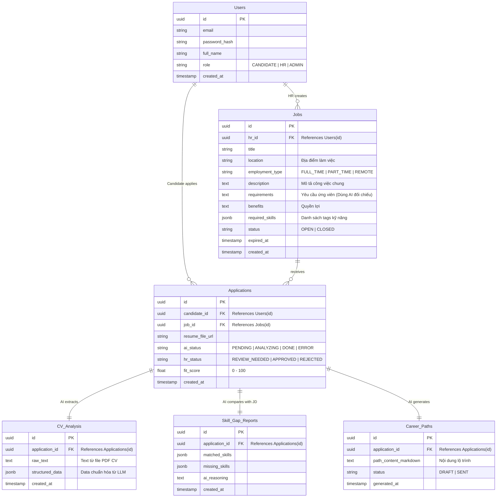

# Tài liệu Phân tích Nghiệp vụ & Kiến trúc Hệ thống (BA & System Architecture)

**Dự án:** Hệ thống AI Agent Hỗ trợ Phân tích Hồ sơ Ứng viên (CV) và Đề xuất Kế hoạch Phát triển Nghề nghiệp.
**Mục tiêu:** Xây dựng một Nền tảng Tuyển dụng & Hướng nghiệp thông minh (Internal ATS), tập trung mũi nhọn vào việc ứng dụng Multi-Agent System để đánh giá và định hướng cho ứng viên.

---

## 1. PHÂN TÍCH NGHIỆP VỤ (BUSINESS ANALYSIS)

### 1.1. Tầm nhìn Sản phẩm (Product Vision)
Thay vì xây dựng một hệ thống ATS truyền thống, hệ thống của chúng ta mang tính **Đột phá và Nhân văn**:
- Ứng viên nộp CV vào một Job. Nếu họ trượt hoặc thiếu kỹ năng, thay vì bị từ chối lạnh lùng, AI sẽ phân tích và đưa ra đánh giá: *"Bạn phù hợp 70%. Bạn đang thiếu kỹ năng A, B. Hãy học lộ trình này trong 2 tháng tới để đáp ứng yêu cầu công việc"*.
- **Giá trị:** Nâng tầm thương hiệu nhà tuyển dụng (Employer Branding) và tạo ra công cụ Hướng nghiệp cực kỳ thiết thực cho sinh viên/người đi tìm việc. 

### 1.2. Các Tác nhân (Actors)
1. **Ứng viên (Candidate):** Xem Job, upload CV, nhận Lộ trình học tập (Career Path).
2. **HR / Nhà tuyển dụng:** Tạo Job (JD), quản lý chiến dịch, ra quyết định duyệt/loại.
3. **Hệ thống Multi-Agent:** Các AI thực hiện bóc tách CV, so khớp JD và sinh lộ trình tư vấn.

### 1.3. Luồng Nghiệp vụ Hybrid & Human-in-the-Loop (Giải quyết bài toán "Tin tưởng AI")
- **Nhóm 1 - Tiềm năng (Fit Score >= 80%):** AI soạn sẵn email mời phỏng vấn, **HR bấm "Duyệt & Gửi"**.
- **Nhóm 2 - Cần xem xét (Fit Score 50% - 79%):** HR xem thủ công. Nếu loại, AI tự sinh Lộ trình phát triển gửi ứng viên.
- **Nhóm 3 - Không phù hợp (Fit Score < 50%):** Tự động hóa hoàn toàn. AI đánh dấu "Reject" và tự động gửi email kèm Lộ trình học tập.

### 1.4. Tính năng Mở rộng: Kho Dữ liệu Thụ động (Talent Pool)
**Câu hỏi nghiệp vụ:** Tại sao công ty đăng tin tuyển dụng ảo (Ghost Jobs) chỉ để thu CV?
- **Mục đích:** Xây dựng **Talent Pool (Hồ chứa nhân tài)**. Công ty muốn gom sẵn dữ liệu ứng viên chất lượng. Khi dự án mới đột xuất ập tới, thay vì mất 1 tháng đăng tin, họ chỉ cần mở kho CV ra và liên hệ ngay những người phù hợp. (Ngoài ra còn để nghiên cứu mặt bằng kỹ năng và lương của thị trường).
- **Đáp ứng của Hệ thống:** Hệ thống của chúng ta hỗ trợ tính năng này hoàn hảo! Khi HR đăng một **Job mới**, hệ thống sẽ tự động chọc vào Vector Database, quét lại toàn bộ kho CV cũ, tìm ra các ứng viên khớp > 80% với Job mới này và dùng **Notification Service** bắn email thông báo mời họ apply.

---

## 2. QUYẾT ĐỊNH CÔNG NGHỆ & KIẾN TRÚC HỆ THỐNG (TECHNICAL DECISIONS)

Kiến trúc hệ thống được nâng cấp lên mô hình **Event-driven Microservices (Microservices hướng Sự kiện)**:

1. **Frontend (Next.js):** Xây dựng giao diện Web (chuẩn SEO).
2. **Main Backend (Spring Boot):** Xử lý Auth, CRUD, kết nối PostgreSQL chính.
3. **AI Core Service (Python + FastAPI):** Chạy luồng LangGraph (AI Agents), kết nối pgvector.
4. **Notification Service (Spring Boot/Node.js):** Service độc lập chỉ làm một việc duy nhất là nhận template và gửi Email/Notification. Tách riêng để khi gửi hàng ngàn email không làm lag hệ thống chính.
5. **Message Broker:** **RABBITMQ**
   - *Lý do chọn RabbitMQ thay vì Kafka:* Kafka sinh ra cho "Data Streaming" (ví dụ: tracking hàng triệu log click chuột/giây). Nhưng hệ thống của chúng ta (Phân tích CV, Gửi Email) bản chất là các **Task Queues (Hàng đợi công việc)**. Việc AI phân tích mất 30s là một task. RabbitMQ là "vua" trong mảng quản lý Task Queue, rất nhẹ nhàng, dễ triển khai, và có cơ chế (Ack/Nack) cực kỳ an toàn để đảm bảo không bị mất CV nếu server AI sập giữa chừng.

**=> Luồng giao tiếp (Event-Driven Flow):**
`Next.js` -> (REST) -> `Spring Boot` -> (Đẩy Message "NEW_CV") -> `RabbitMQ` -> `Python AI` (Lấy CV ra xử lý, xử lý xong đẩy Message "CV_DONE") -> `RabbitMQ` -> `Notification Service` (Nhận lệnh và tự động bắn Email).

---

## 3. THIẾT KẾ CƠ SỞ DỮ LIỆU (DATABASE SCHEMA)

---

## 4. PHÂN RÃ MODULE CỐT LÕI (MODULE BREAKDOWN)

### 4.1. Core Backend (Spring Boot)
1. **Auth & User Module:** Đăng ký, Đăng nhập (JWT), phân quyền.
2. **Job Management Module:** CRUD thông tin Job.
3. **Application Module:** Xử lý file CV.
4. **Message Publisher Client:** Kết nối RabbitMQ để bắn các Event (VD: `CV_UPLOADED`, `JOB_CREATED`).

### 4.2. AI Service (Python FastAPI + LangGraph)
1. **Message Consumer Module:** Lắng nghe RabbitMQ. Kéo CV về phân tích. Hoặc lắng nghe event `JOB_CREATED` để quét database tìm các CV cũ tiềm năng.
2. **PDF Parser Module:** Dùng thư viện `pypdf` trích xuất text.
3. **Multi-Agent Workflow:** Agent 1 (Extract), Agent 2 (Skill Gap Vector Search), Agent 3 (Career Path).
4. **Vector Database Module:** SQLAlchemy + pgvector.

### 4.3. Notification Service
Việc tách riêng service này là bắt buộc trong hệ thống lớn vì 4 lý do thực tế (Use cases):
1. **Multi-Channel (Đa kênh):** Không chỉ gửi Email, service này sẽ chịu trách nhiệm bắn thông báo In-app (cái chuông trên web qua WebSocket), gửi tin nhắn Zalo ZNS hoặc bắn alert sang Slack/Teams cho HR. Core Backend chỉ cần ra lệnh "Báo cho HR", Notification Service sẽ tự biết phải dùng kênh nào.
2. **Rate Limiting & Retry (Chống nghẽn & Gửi lại):** Các dịch vụ SMTP (Gmail, SendGrid) đều giới hạn số email gửi / giây. Nếu HR bấm từ chối 1000 CV, service này sẽ xếp hàng (Queue) để gửi từ từ, không bị chặn vì spam. Nếu rớt mạng, nó tự động gửi lại (Retry) mà không làm sập luồng chính.
3. **Template Engine:** Tách riêng HTML/CSS của các loại thư (Thư từ chối, Lộ trình học tập...) ra khỏi code xử lý nghiệp vụ của Spring Boot.
4. **Tracking (Phân tích):** Gắn pixel tracking để biết ứng viên đã đọc email chưa, có click vào Lộ trình học tập hay không.
5. **Bulk Messaging (Gửi Campaign hàng loạt):** Phục vụ cực tốt cho các chiến dịch Marketing Tuyển dụng (VD: Gửi bản tin việc làm hàng tháng cho 10.000 ứng viên cũ). Bắn hàng ngàn email cùng lúc sẽ làm sập Server chính, nhưng Notification Service kết hợp RabbitMQ thì sẽ xử lý mượt mà (rút từ từ từng email ra gửi).
- **Message Consumer:** Lắng nghe Event từ RabbitMQ (VD: `SEND_REJECTION_EMAIL`, `SEND_JOB_MATCH`).
- **SMTP/WebSocket Sender:** Kết nối Gmail SMTP / SendGrid / WebSocket để gửi thông báo thực tế.

### 4.4. Frontend (Next.js)
1. **Candidate Portal:** Tìm việc, Apply, Xem điểm số & Lộ trình học tập.
2. **HR Dashboard:** Đăng Job, Kanban Board xem xét CV (Human-in-the-loop).
